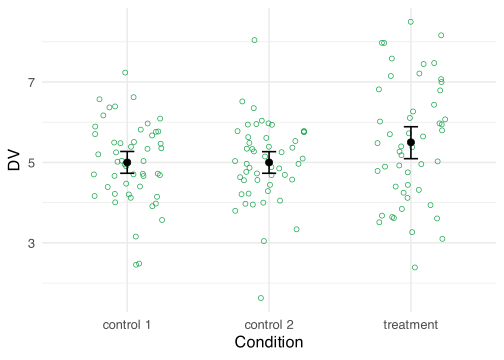
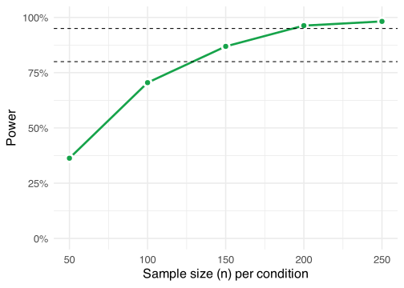

In a previous post I covered how to perform simulation-based power
analyses. A limitation in that post is that usually the question is not
what our power is, but rather which sample size gives us the desired
power. With the code from my previous post you can get to the right
sample size by changing the sample size parameters and then checking
whether this gives you enough power. It’s fine, but it’s a little bit of
a hassle.

A more substantive, and related, limitation is that statistical power
isn’t about a single threshold number that you’re supposed to reach.
Power is a curve, after all. The difference between having obtained 79%
power or 80% power is only 1% and does not strongly affect the
interpretation of your obtained power. The code from my previous post
doesn’t really illustrate this point, so let’s do that here.

## Setup

If you want to follow along, run the following setup code:

<details open class="code-fold">
<summary>Code</summary>

``` r
library(MASS)
library(tidyverse)
library(scales)
library(effectsize)
library(knitr)

theme_set(theme_minimal(base_size = 16))
primary <- "#16a34a"
```

</details>

## The scenario

Let’s look at one of the scenarios from the previous post: the two
*t*-test scenario. We have one treatment condition and two control
conditions. Our goal is to have enough power to find a significant
difference between the treatment condition and *both* control
conditions. Let’s begin with a single simulation, just to see what the
data would look like.

<details open class="code-fold">
<summary>Code</summary>

``` r
# Parameters
M_control1 <- 5
M_control2 <- M_control1
M_treatment <- 5.5
SD_control1 <- 1
SD_control2 <- SD_control1
SD_treatment <- 1.5
N <- 50

# Simulate once
control1 <- mvrnorm(N,
  mu = M_control1, Sigma = SD_control1^2,
  empirical = TRUE
)
control2 <- mvrnorm(N,
  mu = M_control2, Sigma = SD_control2^2,
  empirical = TRUE
)
treatment <- mvrnorm(N,
  mu = M_treatment, Sigma = SD_treatment^2,
  empirical = TRUE
)

# Prepare data
colnames(control1) <- "DV"
colnames(control2) <- "DV"
colnames(treatment) <- "DV"

control1 <- control1 %>%
  as_tibble() %>%
  mutate(condition = "control 1")

control2 <- control2 %>%
  as_tibble() %>%
  mutate(condition = "control 2")

treatment <- treatment %>%
  as_tibble() %>%
  mutate(condition = "treatment")

data <- bind_rows(control1, control2, treatment)
```

</details>

I’ve changed the code a little bit compared to my previous post. We
still assume the same parameters in both control conditions, but now I
use one of the control condition variables to set the value of the
variable from the other control condition. This means you only need to
set the value once and this reduces mistakes due to typos. In addition,
we assume the same sample size in each condition and I also changed the
parameter values.

We inspect the data by visualizing it and by calculating a standardized
effect size that quantifies the difference between the treatment
condition and each of the two control conditions.

<details open class="code-fold">
<summary>Code</summary>

``` r
# Calculate standardized effect size
effect_size <- cohens_d(DV ~ condition,
  pooled_sd = FALSE,
  data = filter(data, condition != "control 1")
)

# Visualize the data
ggplot(data, aes(x = condition, y = DV)) +
  geom_jitter(color = primary, height = 0, width = .25, shape = 21, size = 2) +
  stat_summary(
    fun.data = "mean_cl_boot", geom = "errorbar",
    width = .1, linewidth = 0.75
  ) +
  stat_summary(fun = "mean", geom = "point", size = 3) +
  labs(x = "Condition")
```

</details>


The effect size is a Cohen’s *d* -0.3922323 and although the Cohen’s *d*
is negative (due to the ordering the levels in the condition column),
the values in the treatment condition are higher than in the control
conditions.

As a reminder, I think we should analyze this data with two Welch’s two
sample *t*-tests: one for the difference between the treatment condition
and control group 1 and also one between the treatment condition and
control group 2. Below is some code to run these tests with the current
data frame.

<details open class="code-fold">
<summary>Code</summary>

``` r
t.test(DV ~ condition, data = filter(data, condition != "control 1"))
t.test(DV ~ condition, data = filter(data, condition != "control 2"))
```

</details>

## The power analysis

Next we want to calculate the power. However, we don’t just want the
power for a single sample size. We want to calculate the power for a
range of sample sizes. So we begin by defining this range. In the
example below, we create a variable called `Ns` that contains a sequence
of values ranging from 50 to 250, in steps of 50. We also define `S`,
which is the number of iterations in the power analysis. The higher this
number, the more accurate the power analysis. Note that I’ve capitalized
it this time. The final simulation parameter is `i`. I’ve defined this
variable to keep track of how often we loop. This will be useful for
figuring out where to store the p-values.

We will store the p-values in a data frame this time. Using the
`crossing()` function, we can create a data frame that contains all
possible combinations of the sample sizes and the number of simulation
iterations. We can also already add some empty columns to store the
p-values in.

After that, we begin the loop. We want to loop over each sample size and
we want to loop `S` times for each sample size, running the analyses in
every single loop. This means we have a nested `for` loop. This is not
particularly difficult, as we can simply put a `for` loop within a `for`
loop. The only trick bit is to make sure that you store the p-values
correctly. That’s where the `i` variable comes in. We initially gave it
a value of 1, so the first p-values will be stored in the first row. At
the end of each loop we increment it by 1, making sure that the next
p-values will be stored in the next row of our p-values data frame.

<details open class="code-fold">
<summary>Code</summary>

``` r
# Set simulation parameters
Ns <- seq(from = 50, to = 250, by = 50)
S <- 1000
i <- 1

# Create a data frame to store the p-values in
p_values <- crossing(
  n = Ns,
  s = 1:S,
  p_value1 = NA,
  p_value2 = NA
)

# Loop
for (n in Ns) {
  for (s in 1:S) {
    # Simulate
    control1 <- mvrnorm(n, mu = M_control1, Sigma = SD_control1^2)
    control2 <- mvrnorm(n, mu = M_control2, Sigma = SD_control2^2)
    treatment <- mvrnorm(n, mu = M_treatment, Sigma = SD_treatment^2)

    # Run tests
    test1 <- t.test(control1[, 1], treatment[, 1])
    test2 <- t.test(control2[, 1], treatment[, 1])

    # Extract p-values
    p_values$p_value1[i] <- test1$p.value
    p_values$p_value2[i] <- test2$p.value

    # Increment i
    i <- i + 1
  }
}
```

</details>

The result is a data frame with two columns containing p-values. To
calculate the power, we sum the number of times we find a significant
effect in *both* columns and divide it by the number of iterations per
sample size (`S`). We need to do this for each sample size. The
following code does the trick:

<details open class="code-fold">
<summary>Code</summary>

``` r
power <- p_values %>%
  mutate(success = if_else(p_value1 < .05 & p_value2 < .05, 1, 0)) %>%
  group_by(n) %>%
  summarize(power = sum(success) / S)
```

</details>

## The power curve

With the power for each sample size calculated, we can visualize the
power curve.

<details open class="code-fold">
<summary>Code</summary>

``` r
ggplot(power, aes(x = n, y = power)) +
  geom_line(color = primary, linewidth = 1.25) +
  geom_point(size = 3, shape = 21, color = "white", fill = primary, stroke = 2) +
  geom_hline(yintercept = .80, linetype = "dashed") +
  geom_hline(yintercept = .95, linetype = "dashed") +
  scale_y_continuous(labels = percent, limits = c(0, 1)) +
  labs(x = "Sample size (n) per condition", y = "Power")
```

</details>


That’s it. We can see at which point we have enough power (e.g., 80% or
95%). Do note that we calculated the sample size *per condition*. In the
current scenario, this means you need to multiply the sample size by
three in order to obtain your total sample size.

If you want a smoother graph, you can adjust the range of sample sizes
that we stored in the `Ns` variable. You can, for example, lower the
`by` argument in the `seq()` function to get a more fine-grained curve.
