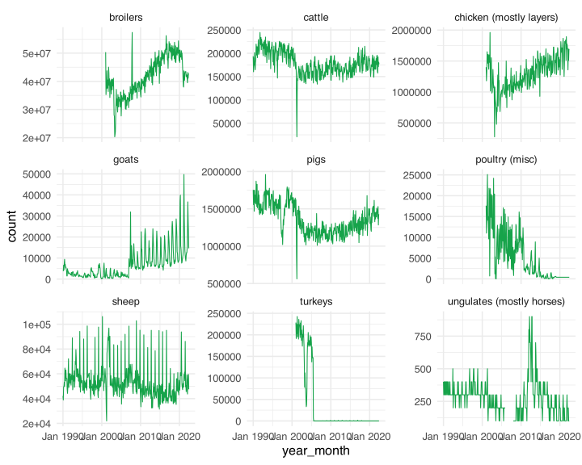
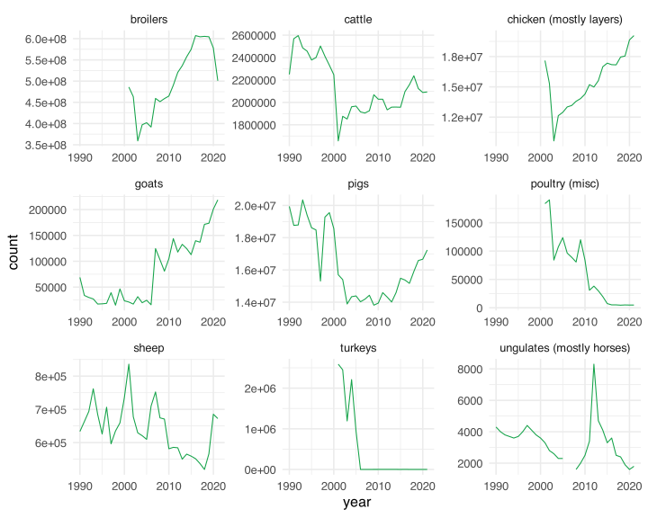

In this post I take a look at how many animals are slaughtered in the
Netherlands. The goal is to find and clean the data to answer this
question and to get a better grasp of exactly how many animals are
killed here every hear. It’s both an exercise in data cleaning and
calibrating one’s beliefs about this topic. It’s a topic that’s easy
easy to avoid thinking about, while probably being one of the most
important things you *should* think about.

## Data

The data on the number of animals slaughtered in the Netherlands can be
found on
[StatLine](https://opendata.cbs.nl/statline#/CBS/nl/ "StatLine"). This
is a database managed by CBS, the national statistical office of the
Netherlands. Specifically, we’re going to take a look at the meat
production numbers (vleesproductie). These numbers can be found in a
table
[here](https://opendata.cbs.nl/#/CBS/nl/dataset/7123slac/table?ts=1663151766192).
We can adapt what is in the table by changing various filters. By
default it shows both the number of animals and the weight of the
animals. I’m only interested in the number of animals, so I deselect the
weight-related rows. I also see that they offer data on more dates than
is shown by default, so I select all of the dates. I then download the
data as a .csv file using the button in the top right corner. Now we can
start cleaning the data for our purposes.

## Setup

Run the following setup code if you want to follow along. You can
download the data yourself or use my
[file](meat-production-netherlands.csv).

<details class="code-fold">
<summary>Code</summary>

``` r
library(tidyverse)
library(zoo)

theme_set(theme_minimal(base_size = 16))
primary <- "#16a34a"

data <- read_csv2("meat-production-netherlands.csv")
```

</details>

Note that we have to use `read_csv2()` because the data values are
separated by a semi-colon. This is an annoying default in the
Netherlands (and probably elsewhere in Europe).

## Data cleaning

Let’s begin by inspecting the first few rows of the data.

<details class="code-fold">
<summary>Code</summary>

``` r
head(data)
```

</details>

| Slachtdieren     | Perioden      | Aantal slachtingen (x 1 000) |
|:-----------------|:--------------|-----------------------------:|
| Rundvee (totaal) | 1990 januari  |                        193.7 |
| Rundvee (totaal) | 1990 februari |                        160.2 |
| Rundvee (totaal) | 1990 maart    |                        189.9 |
| Rundvee (totaal) | 1990 april    |                        174.3 |
| Rundvee (totaal) | 1990 mei      |                        201.4 |
| Rundvee (totaal) | 1990 juni     |                        172.3 |

It should be no surprise, but the data is in Dutch. Let’s translate the
data, starting with the columns. One of the columns is called
`Aantal slachtingen (x 1 000)`, which means number of slaughtered
animals in units of 1000. Instead of translating this directly, I will
simply rename it to `count` and multiply the values by 1000.

<details class="code-fold">
<summary>Code</summary>

``` r
data <- data |>
  rename(
    animal = Slachtdieren,
    period = Perioden,
    count = `Aantal slachtingen (x 1 000)`
  ) |>
  mutate(count = count * 1000)
```

</details>

Let’s clean up the `period` column next. It seems like it contains the
year and the month (in Dutch). I can translate the month names to Dutch,
but I first want to make sure that all data values are structured the
same way. `count()` is a great function to inspect that.

<details class="code-fold">
<summary>Code</summary>

``` r
count(data, period) |> head()
```

</details>

| period        |   n |
|:--------------|----:|
| 1990          |  17 |
| 1990 april    |  17 |
| 1990 augustus |  17 |
| 1990 december |  17 |
| 1990 februari |  17 |
| 1990 januari  |  17 |

Curiously, not all rows in the data contain both the year *and* the
month. Some only have the year. This is important because that means we
can’t just sum the number of slaughtered animals per year because that
means we’ll actually get *twice* the number of animals because we’ll sum
both the animals slaughtered in that year and each month of that year.

Let’s also inspect the bottom few rows.

<details class="code-fold">
<summary>Code</summary>

``` r
count(data, period) |> tail()
```

</details>

| period          |   n |
|:----------------|----:|
| 2022 april\*    |  17 |
| 2022 februari\* |  17 |
| 2022 januari\*  |  17 |
| 2022 juni\*     |  17 |
| 2022 maart\*    |  17 |
| 2022 mei\*      |  17 |

The last several months have an asterisk in the month name. This
asterisk indicates that the data for these months has not yet been
finalized.

What I want to do next is create a new column that only contains the
year and another column that contains the month. Creating the year
column is easy because we can use `parse_number()` to extract the year
from the data. The month is a bit trickier, but we can use a regular
expression to remove the year, leaving us with the month. We use
`str_remove()` and tell it to remove a string pattern that consists of 4
numbers and a space. We can also use it to remove the asterisk from the
more recent months, but first we add a column to say whether the numbers
are final or not based on this asterisk. After doing that, we recode the
month values that need to be translated and also convert the empty
string to a missing value. Finally, we remove the `period` column
because we don’t need it anymore.

<details class="code-fold">
<summary>Code</summary>

``` r
data <- mutate(data,
  year = parse_number(period),
  month = str_remove(period, "[0-9]{4} ?"),
  final = if_else(str_detect(period, "\\*"), "no", "yes"),
  month = str_remove(month, "\\*"),
  month = str_to_sentence(month),
  month = recode(month,
    "Augustus" = "August",
    "Februari" = "February",
    "Januari" = "January",
    "Juli" = "July",
    "Juni" = "June",
    "Maart" = "March",
    "Mei" = "May",
    "Oktober" = "October",
  ),
  month = na_if(month, ""),
  period = NULL
)
```

</details>

Next are the animals. Let’s take a look at the unique values we have.

<details class="code-fold">
<summary>Code</summary>

``` r
count(data, animal)
```

</details>

| animal                               |   n |
|:-------------------------------------|----:|
| Eenhoevigen                          | 422 |
| Geiten (totaal)                      | 422 |
| Kalkoenen                            | 422 |
| Kalveren jonger dan 9 maanden        | 422 |
| Kalveren van 9 tot en met 12 maanden | 422 |
| Koeien                               | 422 |
| Overig pluimvee                      | 422 |
| Overige kippen                       | 422 |
| Rundvee (totaal)                     | 422 |
| Schapen incl. lammeren               | 422 |
| Schapenlammeren                      | 422 |
| Stieren                              | 422 |
| Totaal kalveren                      | 422 |
| Totaal volwassen runderen            | 422 |
| Vaarzen                              | 422 |
| Varkens (totaal)                     | 422 |
| Vleeskuikens                         | 422 |

Hmm… it looks like there are a few challenges here. First, we seem to
have both total values and non-total values, so we should take care to
separate these. Second, we need to figure out what each word means. Even
my Dutch is not helping me in understanding each type of animal.

Let’s first simply translate the values so we get a better grasp of what
we are dealing with. The translations won’t be direct translations.
Instead, I’ll already think about what kind of categories make sense and
how I want to plot the data later, so I translate the values into names
that will also be useful later.

<details class="code-fold">
<summary>Code</summary>

``` r
data <- mutate(data,
  animal = recode(animal,
    "Eenhoevigen" = "ungulates (mostly horses)",
    "Geiten (totaal)" = "goats",
    "Kalkoenen" = "turkeys",
    "Kalveren jonger dan 9 maanden" = "calves (< 9 months)",
    "Kalveren van 9 tot en met 12 maanden" = "calves (9-12 months)",
    "Koeien" = "cows",
    "Overig pluimvee" = "poultry (misc)",
    "Overige kippen" = "chicken (mostly layers)",
    "Rundvee (totaal)" = "cattle",
    "Schapen incl. lammeren" = "sheep",
    "Schapenlammeren" = "lambs",
    "Stieren" = "bulls",
    "Totaal kalveren" = "calves",
    "Totaal volwassen runderen" = "adult cattle (total)",
    "Vaarzen" = "heifers",
    "Varkens (totaal)" = "pigs",
    "Vleeskuikens" = "broilers"
  )
)
```

</details>

Translating the words was very helpful to better understand the data.
One thing that’s clear is that some of the values are totals of other
values. Below I list which values in the data are actually sums of other
values:

- adult cattle: Total of cows, heifers, and bulls
- cattle: Total of adult cattle and calves
- calves: Total of calves (\< 9 months) and calves (9-12 months)

If we are interested in what the totals are made of, we can remove the
total columns and reconstruct them later if we want to. This works for
the first two total columns, but not calves because they only started
making the distinction between young and older calves in 2009. So let’s
instead remove the values that the total values are made of and only
keep the total values.

<details class="code-fold">
<summary>Code</summary>

``` r
data <- filter(
  data,
  !animal %in% c(
    "adult cattle (total)", "cows",
    "heifers", "bulls", "calves", "calves (< 9 months)",
    "calves (9-12 months)", "lambs"
  )
)
```

</details>

This leaves us with the following animals.

<details class="code-fold">
<summary>Code</summary>

``` r
count(data, animal)
```

</details>

| animal                    |   n |
|:--------------------------|----:|
| broilers                  | 422 |
| cattle                    | 422 |
| chicken (mostly layers)   | 422 |
| goats                     | 422 |
| pigs                      | 422 |
| poultry (misc)            | 422 |
| sheep                     | 422 |
| turkeys                   | 422 |
| ungulates (mostly horses) | 422 |

This looks fine to me, which means we are almost done with the data
cleaning. At this point I want to create two separate data frames: one
that only contains the annual data and one that contains the monthly
data. This is easy to do because we can take all the annual data by
simply selecting the rows with a missing value in the `month` column.
And since the `month` column is useless in that data frame, we remove
it.

<details class="code-fold">
<summary>Code</summary>

``` r
data_annual <- data |>
  filter(is.na(month)) |>
  select(-month)

data <- filter(data, !is.na(month))
```

</details>

As a final step we can combine the `year` and `month` columns from the
monthly data frame into a single column, which will be useful for
plotting the data later. This requires a special function from the `zoo`
package (`as.yearmon()`)

<details class="code-fold">
<summary>Code</summary>

``` r
data <- mutate(
  data,
  month = str_to_sentence(month),
  month = match(month, month.name),
  year_month = paste(year, month, "1", sep = "-"),
  year_month = as_date(year_month),
  year_month = as.yearmon(year_month)
)
```

</details>

## Data analysis

With the data cleaned up we can start to ask some questions. Let’s begin
with a graph that shows as much of the data as possible. That means
plotting the monthly data for each animal.

<details class="code-fold">
<summary>Code</summary>

``` r
ggplot(data, aes(x = year_month, y = count)) +
  geom_line(color = primary) +
  facet_wrap(~animal, scales = "free_y")
```

</details>



The monthly numbers seem to fluctuate quite a bit, so let’s plot annual
data instead.

<details class="code-fold">
<summary>Code</summary>

``` r
ggplot(data_annual, aes(x = year, y = count)) +
  geom_line(color = primary) +
  facet_wrap(~animal, scales = "free")
```

</details>



That’s clearer.

The first thing that jumps out to me is that some of the numbers are
very high. In fact, they’re so high that ggplot has switched to the
scientific notation to represent the numbers.

I also see an increase in the number of animals slaughtered for some of
the animal groups, such as goats and non-broiler chickens. There has
also been a steady increase in the number of slaughtered broiler
chickens over the years, although it has decreased somewhat in the last
several years. I don’t know why that is.

There are several other animal groups that have had worse years, like
cattle and pigs. We see a huge drop around the year 2000, caused by the
outbreak of foot-and-mouth disease and subsequent regulation. The
numbers have been increasing again since, which I figured was the case,
but I did not know that there was a time when even more of these animals
were being slaughtered.

Let’s hone in on some exact numbers. Below we create a table to show the
number of slaughtered animals in 2021, per animal.

<details class="code-fold">
<summary>Code</summary>

``` r
data_annual |>
  filter(year == 2021) |>
  arrange(desc(count)) |>
  select(animal, count)
```

</details>

| animal                    |     count |
|:--------------------------|----------:|
| broilers                  | 500732500 |
| chicken (mostly layers)   |  20079200 |
| pigs                      |  17236800 |
| cattle                    |   2093300 |
| sheep                     |    672400 |
| goats                     |    218700 |
| poultry (misc)            |      4800 |
| ungulates (mostly horses) |      1800 |
| turkeys                   |         0 |

Oof. That’s over 500 million chickens! For reference, the Netherlands
had a population of 17.17 million people in 2021.

How many animals were slaughtered in total, in 2021?

<details class="code-fold">
<summary>Code</summary>

``` r
count_total_2021 <- data_annual |>
  filter(year == 2021) |>
  summarize(count_total = sum(count)) |>
  pull(count_total)
```

</details>

Apparently a total of 541039500, or 17.16 animals per second. That’s a
bit of a bummer to end on, but then, this post was never going to have a
happy ending.
