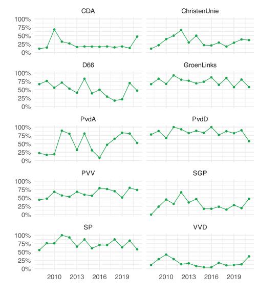

Not too long ago the House of Representatives of The Netherlands
released a public
[portal](https://opendata.tweedekamer.nl "Open Data Portal House of Representatives")
to a lot of their data. The portal contains data on law proposals,
motions, rapports, etc. I’ve been interested in this kind of data for a
while now because I want to know more about the voting behavior of
political parties. Specifically, I want to know which parties
consistently vote in favor of improving animal rights. It’s relatively
easy for a political party to *say* that they care about animal rights,
but that doesn’t mean they consistently vote in favor of motions that
improve animal welfare. So let’s figure out how the open data portal
works and which party to vote for.

Run the following setup code if you want to follow along.

<details open class="code-fold">
<summary>Code</summary>

``` r
library(tidyverse)
library(scales)
library(jsonlite)

theme_set(theme_minimal(base_size = 16))
primary <- "#16a34a"
```

</details>

## Getting the data

We will use the [OData
API](https://opendata.tweedekamer.nl/documentatie/odata-api "OData API")
to obtain the data. Using this API is pretty easy in theory; it’s
nothing more than constructing a URL and then retrieving the data using
that URL. The only tricky bit is how to set it up. In order to know how
to do that, we need to understand the API. The OData API links to an
[information
model](https://opendata.tweedekamer.nl/documentatie/informatiemodel "OData API information model")
that shows what kind of data we can request. We can request different
entities, such as a Zaak (case), Document, Activiteit (activity), and so
on. Going through the documentation I figured out we want to request
cases because they have a Besluit (decision) entity, which contain a
Stemming (vote) entity. Now that we sort of know what we want, we need
to figure out how to actually get it.

The documentation of the API is pretty good. They explain how to set up
the URL, call a query, and even provide several examples.

Each query starts with the base URL:
[`https://gegevensmagazijn.tweedekamer.nl/OData/v4/2.0/`](https://gegevensmagazijn.tweedekamer.nl/OData/v4/2.0).
We need to append additional functions to this URL to hone in on the
exact data we want.

The first thing we’ll specify is that we want a Zaak (case), so we will
append `Zaak` to the end of the base URL.

Next, we will apply some filter functions. In the documentation they
recommend that we always filter on entities that have not been removed.
They keep removed entities in the database so they can track changes. In
one of the examples we can see how this is done. We have to append the
following to the URL:
[`?$filter=Verwijderd eq false`](https://gegevensmagazijn.tweedekamer.nl/OData/v4/2.0/Persoon?$filter=Verwijderd%20eq%20false%20and%20(Functie%20eq%20%27Eerste%20Kamerlid%27%20or%20Functie%20eq%20%27Tweede%20Kamerlid%27)).
The (first) filter needs to start with a question mark and a dollar
sign, followed by the function name (`filter`), an equal sign, and a
condition. The condition in this case is `Verwijderd eq false`, in other
words: Removed equals false.

Additional filters can be added using logical operators such as `and`,
`or`, or `not`. We want to request only cases that are motions, so we’ll
add `and Soort eq 'Motie'`. Notice that we use `and` because we want
both conditions to be true. The filter itself means that we want the
Soort (type) to be equal to ‘Motie’ (motion). If we were to stop here,
we would get a bunch of different motions, many of which have nothing to
do with animal welfare. So let’s add another filter:
`and contains(Titel, 'Dierenwelzijn')`. This means we select only the
motions whose title contains the word ‘Dierenwelzijn’ (animal welfare).
We could run this, but then we will get a total of 250 cases. It turns
out that this is the maximum number of entities you can retrieve. That’s
not ideal because preferably we get all of the animal welfare-related
motions and if we get 250 back it’s not clear whether we got all of
them. So let’s add another filter: `and year(GestartOp) eq 2021`. This
means we only want cases when they’ve started in 2021. This probably
results in fewer than 250 relevant motions, meaning we obtained them all
(of that year).

The final function we need to add is an expand function. Right now we’re
only requesting the data of motions, but not the data of the decision
that was made in the motion, or the voting data. To also include that in
the request we need to use the expand function. It’s a bit tricky
because we need to run the expand function twice, once to expand on the
decision and once on the voting. The part we need to append to the URL
is: `&$expand=Besluit($expand=Stemming)`.

Now our URL is pretty much done. We have to paste all the parts together
and request the data. We also need to replace all spaces with `%20` so
that it becomes a valid URL. You don’t need to do this if you just want
to paste the URL in the browser, but if you want to use R code like in
the code below, we do need to do this.

The data will be returned in a JSON format by the API. In R there’s the
jsonlite package to work with JSON data, so we’ll use that package. The
following code sets up the URL and retrieves the data.

<details open class="code-fold">
<summary>Code</summary>

``` r
# Set url components
base_url <- "https://gegevensmagazijn.tweedekamer.nl/OData/v4/2.0/"
entity <- "Zaak"
filter1 <- "?$filter=Verwijderd eq false"
filter2 <- " and Soort eq 'Motie'"
filter3 <- " and contains(Titel, 'Dierenwelzijn')"
filter4 <- " and year(GestartOp) eq 2021"
expand <- "&$expand=Besluit($expand=Stemming)"

# Construct url
url <- paste0(base_url, entity, filter1, filter2, filter3, filter4, expand)

# Escape all spaces by replacing them with %20
url <- str_replace_all(url, " ", "%20")

# Get data
data <- read_json(url)
```

</details>

You can inspect the retrieved data
[here](../../../data/motions-2021.json "2021 motions data").

## Cleaning the data

The data is structured as a list with various attributes, including
additional lists. I personally don’t like working with lists at all in R
so I want to convert it to a data frame as soon as possible. My favorite
way of converting lists to a data frame is by using `map_df()`. It’s a
function that accepts a list as its first argument and a function as its
second argument. The function will be applied to each element in the
list and the results of that will automatically be merged into a data
frame. So let’s create that function.

In the code below we create a function that accepts an element of the
`value` attribute in `data`, which is a list of cases we requested. The
function then creates a data frame with only some of the case
attributes: the number, title, subject, and start date. You can figure
out which attributes are available by checking the documentation or
going through the data we just obtained. After creating this function we
run `map_df()`.

<details open class="code-fold">
<summary>Code</summary>

``` r
# Create a custom function to extract data from each motion
clean_zaak <- function(zaak) {
  df <- tibble(
    number = zaak$Nummer,
    start_date = as_date(zaak$GestartOp),
    title = zaak$Titel,
    subject = zaak$Onderwerp
  )
}

# Run the clean_zaak function on each case
df <- map_df(data$value, clean_zaak)
```

</details>

The result is the following data frame:

<details open class="code-fold">
<summary>Code</summary>

``` r
head(df)
```

</details>

| number | start_date | title | subject |
|:---|:---|:---|:---|
| 2021Z05927 | 2021-04-13 | Dierenwelzijn | Motie van het lid Wassenberg over geen uitzonderingen op het gebruik van stroomstootapparatuur |
| 2021Z13420 | 2021-07-07 | Dierenwelzijn | Motie van de leden Vestering en Beckerman over zorgen dat camerabeelden uit slachthuizen eigendom worden van de overheid |
| 2021Z05929 | 2021-04-13 | Dierenwelzijn | Motie van de leden Bisschop en Van der Plas over een uitzondering voor laag energetische halsbanden |
| 2021Z10743 | 2021-06-14 | Dierenwelzijn | Gewijzigde motie van de leden Beckerman en Boswijk over een onderzoek naar een verbod op het doden van haantjes (t.v.v. 28286-1189) |
| 2021Z10427 | 2021-06-09 | Dierenwelzijn | Motie van het lid Van der Plas over een impactanalyse van de wetswijziging voor de handhaafbaarheid |
| 2021Z10757 | 2021-06-14 | Dierenwelzijn | Gewijzigde motie van het lid Van der Plas over een impactanalyse van de wetswijziging voor de handhaafbaarheid (t.v.v. 28286-1193) |

We can see that all the dates are from 2021 and that the titles contain
the word ‘Dierenwelzijn’, just like we filtered on. The `subject` column
is more interesting. It shows us what the case was about. After
inspecting some of the subjects it becomes obvious that not all cases
are about improving animal welfare. One, for example, is about using
mobile kill units to kill animals that can’t be transported to a
slaughterhouse. Ideally, we should go over all the cases and judge
whether the case is about something that improves animal welfare or not.

Alternatively, we can rely on the heuristic (for now) that in general
all the cases on animal welfare are about things that improve animal
welfare. Since we’re relying on a heuristic, it would help if we get
more data so we can have the exceptions to this heuristic be overruled
by many more data points. So let’s retrieve much more data.

## Getting even more data

Below I loop over several years and retrieve the data for that year.
After retrieving the data, it is saved to a file using the
`write_json()` function. It has an `auto_unbox` argument so that
attributes that only consist of 1 attribute aren’t stored as lists but
directly as the type of attribute itself (e.g., a number or string).
There’s also the `pretty` argument which makes sure the file is at least
somewhat readable, rather than one single very long line of data.

<details open class="code-fold">
<summary>Code</summary>

``` r
# Set years we want the data of
years <- 2008:2021

# Set url components
base_url <- "https://gegevensmagazijn.tweedekamer.nl/OData/v4/2.0/"
entity <- "Zaak"
filter1 <- "?$filter=Verwijderd eq false"
filter2 <- " and Soort eq 'Motie'"
filter3 <- " and contains(Titel, 'Dierenwelzijn')"
filter4 <- " and year(GestartOp) eq "
expand <- "&$expand=Besluit($expand=Stemming)"

# Loop over the years
for (year in years) {
  # Construct the url
  url <- paste0(
    base_url, entity, filter1, filter2, filter3, filter4,
    year, expand
  )

  # Escape all spaces
  url <- str_replace_all(url, " ", "%20")

  # Get data
  data <- read_json(url)

  # Write the data to a file
  write_json(
    data,
    path = paste0("motions-", year, ".json"),
    auto_unbox = TRUE,
    pretty = TRUE
  )
}
```

</details>

## Cleaning even more data

Now that we have a bunch of data files, we need to read them in. A
technique to read in multiple files of the same type is to use
`map_df()` again. We can give it a list of files, created with
`list.files()`, and apply a function to each file path. Not only can we
use that to simply read in the data, we can immediately parse the data
and convert it to a data frame. In the code below I go all inception on
this problem and define multiple functions that each convert a list to a
data frame. There’s a function for reading in a file, converting a case
to a data frame, which calls a function to convert a decision to a data
frame, which calls a function to convert a vote to a data frame. It may
seem a bit complicated, but once you realize you can call functions
within functions, it can actually make some tricky problems easy to
solve; at least with relatively little code.

<details open class="code-fold">
<summary>Code</summary>

``` r
read_file <- function(file) {
  data <- read_json(file)

  df <- map_df(data$value, clean_zaak)

  return(df)
}

clean_zaak <- function(zaak) {
  df <- tibble(
    motion_number = zaak$Nummer,
    start_date = as_date(zaak$GestartOp),
  )

  df <- tibble(
    df,
    map_df(zaak$Besluit, clean_besluit)
  )

  return(df)
}

clean_besluit <- function(besluit) {
  df <- tibble(
    decision_outcome = besluit$BesluitTekst
  )

  if (length(besluit$Stemming) != 0) {
    df <- tibble(
      df,
      map_df(besluit$Stemming, clean_stemming)
    )
  }

  return(df)
}

clean_stemming <- function(stemming) {
  df <- tibble(
    party = stemming$ActorFractie,
    vote = stemming$Soort,
    mistake = stemming$Vergissing
  )

  return(df)
}

# Create a list of the files we want to read
files <- list.files(pattern = "motions-[0-9]+.json")

# Apply the read_file() function to each file, which calls each other function
df <- map_df(files, read_file)
```

</details>

Let’s clean up the resulting data frame some more because we kept more
information than we actually need. For example, there are different
types of decision outcomes, but we only care about the ones where a
voting took place. Let’s also translate the votes to English and exclude
votes of parties that did not participate (they are still included) and
mistaken votes (apparently sometimes they make mistakes when voting).

<details open class="code-fold">
<summary>Code</summary>

``` r
df <- df |>
  filter(str_detect(decision_outcome, "Verworpen|Aangenomen")) |>
  filter(vote != "Niet deelgenomen") |>
  filter(!mistake) |>
  mutate(
    decision_outcome = str_extract(decision_outcome, "Verworpen|Aangenomen"),
    decision_outcome = recode(
      decision_outcome,
      "Verworpen" = "rejected",
      "Aangenomen" = "accepted"
    ),
    start_date = year(start_date),
    vote = recode(vote, "Tegen" = "nay", "Voor" = "aye"),
    vote = factor(vote),
    mistake = NULL
  )
```

</details>

Annoyingly, I discovered that the decision outcome data changed over the
years in a trivial way. Starting in the year 2013, they added a period
to the description of the decision outcome (e.g., ‘Verworpen**.**’). A
silly change that actually resulted in me missing data from the years
before 2013 while initially writing this post.

We now have the following data frame:

<details open class="code-fold">
<summary>Code</summary>

``` r
head(df)
```

</details>

| motion_number | start_date | decision_outcome | party      | vote |
|:--------------|-----------:|:-----------------|:-----------|:-----|
| 2008Z03619    |       2008 | rejected         | Verdonk    | nay  |
| 2008Z03619    |       2008 | rejected         | GroenLinks | nay  |
| 2008Z03619    |       2008 | rejected         | SP         | nay  |
| 2008Z03619    |       2008 | rejected         | PvdA       | nay  |
| 2008Z03619    |       2008 | rejected         | PVV        | nay  |
| 2008Z03619    |       2008 | rejected         | VVD        | nay  |

## Analyzing voting behavior

Now we are ready to inspect the voting behavior of the political
parties. For each party we calculate how often they voted ‘aye’ or ‘nay’
and calculate it as a percentage of the times they’ve voted. We then
plot the percentage of times they voted ‘aye’.

<details open class="code-fold">
<summary>Code</summary>

``` r
voting <- df |>
  count(party, vote, .drop = FALSE) |>
  pivot_wider(names_from = vote, values_from = n) |>
  mutate(
    votes = aye + nay,
    aye_pct = aye / votes
  )

ggplot(voting, aes(x = aye_pct, y = reorder(party, aye_pct))) +
  geom_col(aes(alpha = votes), fill = primary) +
  labs(
    x = "Times voted 'aye' on an animal welfare motion (in %)",
    y = "",
    alpha = "Times voted"
  ) +
  scale_x_continuous(
    expand = expansion(mult = c(0, 0.05)),
    limits = c(0, 1),
    labels = percent
  ) +
  theme(panel.grid.major.y = element_blank())
```

</details>


It seems like the heuristic might be somewhat justified. I don’t know
much about Van Kooten-Arissen or Group Krol/vKA, but PvdD stands for
Partij voor de Dieren (Party for the Animals). It makes sense that they
are among the top in voting in favor of improving animal welfare. At the
same time there’s some evidence that the heuristic is indeed only a
heuristic. The PvdD apparently voted ‘aye’ in 84.13% of the motions.
That could mean there are some motions where it is in the interest of
the animals to vote ‘nay’. I also find it a bit worrying that the PVV, a
notorious right-wing party in the Netherlands, is so high on the list of
voting ‘aye’ on animal welfare matters. In some manual inspections of
the motions I saw they tend to disagree with some obvious animal welfare
improvements, although perhaps my sample just happened to find these
disagreements and had I inspected more motions I would have found the
same results.

Another way we can look at this data is by using the PvdD as a benchmark
for what the other political parties should vote for. We can assume that
this party has the best interest for animals in mind, as that is their
most important platform. Of course this would mean we can’t use the
result to figure out whether we should vote for PvdD, but it can be
useful to figure out which alternative party to vote for.

<details open class="code-fold">
<summary>Code</summary>

``` r
vote_matches_PvdD <- df |>
  filter(party == "PvdD") |>
  group_by(motion_number) |>
  summarize(vote_PvdD = first(vote)) |>
  right_join(df, by = "motion_number") |>
  filter(party != "PvdD") |>
  mutate(
    match = if_else(vote == vote_PvdD, "match", "no_match"),
    match = factor(match)
  ) |>
  count(party, match, .drop = FALSE) |>
  pivot_wider(names_from = match, values_from = n) |>
  mutate(
    votes = match + no_match,
    match_pct = match / votes
  )

ggplot(vote_matches_PvdD, aes(x = match_pct, y = reorder(party, match_pct))) +
  geom_col(aes(alpha = votes), fill = primary) +
  labs(
    x = "Times voted the same as the Party for the Animals (in %)",
    y = "",
    alpha = "Times voted"
  ) +
  scale_x_continuous(
    expand = expansion(mult = c(0, 0.05)),
    limits = c(0, 1),
    labels = percent
  ) +
  theme(panel.grid.major.y = element_blank())
```

</details>


It looks like the two graphs are fairly consistent. Van Kooten-Arissen
and Groep Krol/vKA are still at the top. The same goes for the bigger
parties. In fact, the ranking of the largest parties (who have voted the
most times) is the same in the two graphs. That can give us some extra
confidence that the heuristic from the first graph works.

Let’s go back to our heuristic and create another graph that shows the
voting behavior across the years. After all, it could very well be that
a political party changed their values in the last decade. Let’s only
use the 10 biggest parties for this graph because they’re more likely to
have enough data for each year.

<details open class="code-fold">
<summary>Code</summary>

``` r
voting_years <- df |>
  group_by(party) |>
  mutate(votes = n()) |>
  filter(votes > 300) |>
  count(start_date, party, vote, .drop = FALSE) |>
  pivot_wider(names_from = vote, values_from = n) |>
  mutate(
    votes = aye + nay,
    aye_pct = aye / votes
  )

ggplot(
  voting_years,
  aes(x = start_date, y = aye_pct)
) +
  geom_line(color = primary) +
  geom_point(color = primary) +
  facet_wrap(~party, ncol = 2) +
  labs(x = "", y = "") +
  scale_y_continuous(limits = c(0, 1), labels = percent)
```

</details>



Looks like most parties are fairly consistent. There’s some variation
from year to year, but for most parties you can tell whether they are
pro-animal or not. There are some exceptions to this, like the PvdA and
D66, which seem to vary quite a bit. We can actually calculate this
variation so we don’t have to guess it from the graph.

<details open class="code-fold">
<summary>Code</summary>

``` r
voting_years |>
  group_by(party) |>
  summarize(SD = sd(aye_pct)) |>
  arrange(desc(SD))
```

</details>

| party        |        SD |
|:-------------|----------:|
| PvdA         | 0.2901784 |
| D66          | 0.2040161 |
| SGP          | 0.1715211 |
| CDA          | 0.1602745 |
| ChristenUnie | 0.1511710 |
| SP           | 0.1378113 |
| PVV          | 0.1194097 |
| VVD          | 0.1193068 |
| PvdD         | 0.1161352 |
| GroenLinks   | 0.1088361 |

Yup, looks like PvdA and D66 are the least consistent.

## Limitations

It bears repeating that this analysis of the data isn’t perfect. The
best way to analyze this data would be to take a look at each individual
motion and determine, based on your own values, whether an ‘aye’ vote or
a ‘nay’ vote is in the best interest of animals. I hope to do this
myself in the future.

Another limitation of this analysis is that we have only searched for
motions that mention animal welfare in the title. There are many more
motions that address animal welfare issues that we’ve missed with our
method. The results could therefore be made more reliable by adding more
data. In this post we have looked at 5453 votes in 391 motions. I
suppose that’s decent, but we could do better.

## Conclusion

In this post we used publicly available data from the House of
Representatives of the Netherlands to inspect the voting behavior of
political parties on matters related to animal welfare. This is made
possible by the amazing new data portal that makes this data freely and
relatively easily available to everyone. Kudos to them for that.

If you’re interested in figuring out which party to vote for because you
want to support animal welfare, then the largest parties to pay
attention to are the PvdD, GroenLinks, and SP. They are large enough to
have voted on issues a decent number of times, giving us some confidence
that they vote in favor of improving animal welfare. More can be done to
improve this interpretation of the data, but looking at actual voting
behavior seems like a valuable piece of information when considering
which party to vote for.
