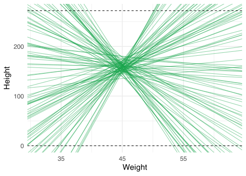
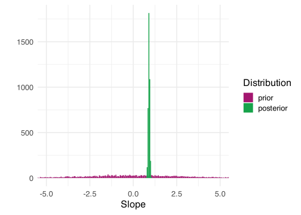
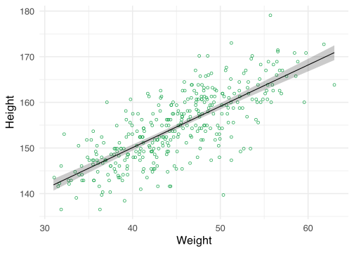
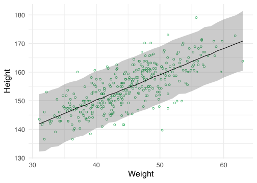

In my previous [blog
post](../../../blog/5-bayesian-tutorial-intercept-only) I showed how to
use brms and tidybayes to run an intercept-only model. Now let’s extend
that model by adding a predictor.

The [data](../../../data/Howell1.csv) is the same as in the previous
post (including the filter that we only focus on people 18 years or
older). This data contains weight data as well as height data, so that
means we can run a model in which we regress heights onto weights, i.e.,
a regression with a single predictor.

If you want to follow along, run the following setup code.

<details class="code-fold">
<summary>Code</summary>

``` r
library(tidyverse)
library(brms)
library(tidybayes)
library(modelr)

theme_set(theme_minimal(base_size = 16))
primary <- "#16a34a"
secondary <- "#A3166F"
palette <- c(primary, "#138d40", "#107636", "#0d602b")

options(
  mc.cores = 4,
  brms.threads = 4,
  brms.backend = "cmdstanr",
  brms.file_refit = "on_change"
)

data <- read_csv("Howell1.csv")
data <- filter(data, age >= 18)
```

</details>

## Adding a single predictor

The formula syntax for a model in which we regress heights onto weights
is `height ~ weight`. We can use this formula in `get_prior()` to see
which priors we need to specify.

<details class="code-fold">
<summary>Code</summary>

``` r
get_prior(height ~ weight, data = data)
```

</details>

| prior                    | class     | coef   | group | resp | dpar | nlpar | lb  | ub  | source  |
|:-------------------------|:----------|:-------|:------|:-----|:-----|:------|:----|:----|:--------|
|                          | b         |        |       |      |      |       |     |     | default |
|                          | b         | weight |       |      |      |       |     |     | default |
| student_t(3, 154.3, 8.5) | Intercept |        |       |      |      |       |     |     | default |
| student_t(3, 0, 8.5)     | sigma     |        |       |      |      |       | 0   |     | default |

The output is a bit trickier compared to the intercept-only model
output. There’s the Intercept and sigma priors again, as well as two
extra rows referring to a class called `b`. These two rows actually
refer to the same prior, one refers specifically to the weight predictor
and one refers to all predictors. If you run a model with many more
predictors, you could set one prior that applies to all predictors. In
this case though, we only have 1 predictor so it actually doesn’t
matter, both refer to the same prior.

Recall from the previous post that I said writing down your model
explicitly is a better way to understand what you’re doing, so let’s go
ahead and do that.

<math> $$
heights_i ∼ Normal(\mu_i, \sigma)\\\\\mu_i = \alpha + \beta x_i
$$ </math>

We again specify that the heights are normally distributed, so we still
have a <math>$\mu$</math> and <math>$\sigma$/<math>, but this time the
<math>$\mu$</math> is no longer a parameter to estimate. Instead, it’s
constructed from other parameters, <math>$\alpha$</math>,
<math>$\beta$</math>, and an observed variable <math>$x_i$</math> (the
weight observations).

If you’re used to linear regression equations, this notation should not
surprise you. <math>$\alpha$</math> refers to the intercept and
<math>$\beta$</math> to the slope.

We need to set priors on these parameters. The prior for
<math>$\alpha$</math> can be the same as the prior for
<math>$\mu$</math> from the previous intercept-only model if we center
the data so the intercept refers to the average height of someone with
an average weight, rather than someone with 0 weight (the default, which
makes no sense). So let’s first mean center the weight observations.

<details class="code-fold">
<summary>Code</summary>

``` r
data <- mutate(data, weight_mc = weight - mean(weight))
```

</details>

Now we can use the same prior as before, which was a normal distribution
with a mean of 160 and a standard deviation of 10 (assuming we did not
update this as a result of the previous analysis).

Next is the prior for the slope. This represents the relationship
between weights and heights. For every 1 increase in weight, how much do
we think that the height will increase or decrease? We could begin with
an agnostic prior in which we do not specify the direction and instead
just add some uncertainty so the slope can go in either direction. For
example, let’s put a normal distribution on the slope with a mean of 0
and a standard deviation of 10.

Finally, we have the prior for sigma (<math>$\sigma$</math>). To remind
you, sigma refers to the standard deviation of the errors or the
residual standard deviation. Now that we have a predictor that means the
sigma can be less than what it was in the intercept-only model because
some of the variance in heights might be explained by the weights,
decreasing the size of the residuals and therefore sigma. So, if we
believe in a relationship between heights and weights, we should change
our prior for sigma so that it’s lower. Given that we used a prior for
the slope that is agnostic (there could be a positive, negative, or no
relationship), our prior for sigma could be left unchanged because it
was broad enough to allow for these possibilities.

## Prior predictive check

We can again create a prior predictive check to see whether our priors
actually make sense. However, instead of plotting the predicted
distribution of heights, we’re mostly interested in the relationship
between weight and height, so we should plot a check of that
relationship instead. We could simulate our own data like I did in the
previous post or we can just run the Bayesian model and only draw from
the prior, which I also did in the previous post and will do so again
here.

<details class="code-fold">
<summary>Code</summary>

``` r
model_height_weight_prior <- brm(
  height ~ weight_mc,
  data = data,
  family = gaussian,
  prior = c(
    prior(normal(160, 10), class = "Intercept"),
    prior(cauchy(5, 5), class = "sigma"),
    prior(normal(0, 10), class = "b")
  ),
  sample_prior = "only",
  seed = 4,
  silent = 2,
  file = "models/model_height_weight_prior.rds"
)
```

</details>

We can use the `spread_draws()` function to get draws from the posterior
distribution of the intercept and slope parameters. With an intercept
and slope we can visualize the relationship we’re interested in.
Remember, though, that brms will give you 4000 draws by default from the
posteriors. In other words, you get 4000 intercepts and slopes. That’s a
bit much to visualize, so let’s only draw 100 intercepts and slopes.

To help make sense of the sensibility of the slopes I’ve added the
average weight to the weights so we’re back on the normal scale and not
the mean centered scale and I’ve added two dashed lines to indicate a
very obvious minimum and a possible maximum height (the tallest human
ever).

<details class="code-fold">
<summary>Code</summary>

``` r
draws <- spread_draws(
  model_height_weight_prior,
  b_Intercept, b_weight_mc,
  ndraws = 100
)

weight_mean <- data |>
  pull(weight) |>
  mean()

ggplot(data, aes(x = weight_mc, y = height)) +
  geom_blank() +
  geom_abline(
    data = draws,
    mapping = aes(intercept = b_Intercept, slope = b_weight_mc),
    color = primary, alpha = .5
  ) +
  geom_hline(yintercept = 0, linetype = "dashed") +
  geom_hline(yintercept = 272, linetype = "dashed") +
  labs(x = "Weight", y = "Height") +
  scale_x_continuous(labels = function(x) round(x + weight_mean))
```

</details>



The plot shows a wide range of possible slopes, some of which are
definitely unlikely because they lead to heights that are smaller than 0
or higher than the tallest person who ever lived. We should lower our
uncertainty by reducing the standard deviation on the prior. In the next
model I lower it to 3.

Additionally, the negative slopes are actually also pretty unlikely
because we should expect a positive relationship between weight and
height (taller people tend to be heavier). We could therefore also
change our prior to force it to be positive using the `lb` argument in
our prior for `b` or use a distribution that doesn’t allow for any
negative values. Let’s not do this though. Let’s assume we have no idea
whether the relationship will be positive or negative and instead focus
on the standard deviation instead so that we don’t obtain relationships
we definitely know are unlikely.

<details class="code-fold">
<summary>Code</summary>

``` r
model_height_weight_prior_2 <- brm(
  height ~ weight_mc,
  data = data,
  family = gaussian,
  prior = c(
    prior(normal(160, 10), class = "Intercept"),
    prior(cauchy(5, 5), class = "sigma"),
    prior(normal(0, 3), class = "b")
  ),
  sample_prior = "only",
  seed = 4,
  silent = 2,
  file = "models/model_height_weight_prior_2.rds"
)
```

</details>

Let’s inspect the lines again.

<details class="code-fold">
<summary>Code</summary>

``` r
draws <- spread_draws(
  model_height_weight_prior_2, b_Intercept, b_weight_mc,
  ndraws = 100
)

ggplot(data, aes(x = weight_mc, y = height)) +
  geom_blank() +
  geom_hline(yintercept = 0, linetype = "dashed") +
  geom_hline(yintercept = 272, linetype = "dashed") +
  geom_abline(
    data = draws,
    mapping = aes(intercept = b_Intercept, slope = b_weight_mc),
    color = primary, alpha = .5
  ) +
  labs(x = "Weight", y = "Height") +
  scale_x_continuous(labels = function(x) round(x + weight_mean))
```

</details>


This looks a lot better, so let’s run the model for real now.
`sample_prior` is now set to `TRUE` so we obtain samples of both prior
and posterior distributions.

<details class="code-fold">
<summary>Code</summary>

``` r
model_height_weight <- brm(
  data = data,
  height ~ weight_mc,
  family = gaussian,
  prior = c(
    prior(normal(160, 10), class = "Intercept"),
    prior(cauchy(5, 5), class = "sigma"),
    prior(normal(0, 3), class = "b")
  ),
  sample_prior = TRUE,
  seed = 4,
  silent = 2,
  file = "models/model_height_weight.rds"
)

model_height_weight
```

</details>

     Family: gaussian 
      Links: mu = identity; sigma = identity 
    Formula: height ~ weight_mc 
       Data: data (Number of observations: 352) 
      Draws: 4 chains, each with iter = 2000; warmup = 1000; thin = 1;
             total post-warmup draws = 4000

    Regression Coefficients:
              Estimate Est.Error l-95% CI u-95% CI Rhat Bulk_ESS Tail_ESS
    Intercept   154.59      0.27   154.07   155.12 1.00     3749     2951
    weight_mc     0.91      0.04     0.82     0.99 1.00     4502     3310

    Further Distributional Parameters:
          Estimate Est.Error l-95% CI u-95% CI Rhat Bulk_ESS Tail_ESS
    sigma     5.10      0.19     4.74     5.50 1.00     4691     3009

    Draws were sampled using sample(hmc). For each parameter, Bulk_ESS
    and Tail_ESS are effective sample size measures, and Rhat is the potential
    scale reduction factor on split chains (at convergence, Rhat = 1).

The estimate for the weight predictor is 0.91. For every increase of
weight by 1 we can expect height to increase by this number. We can also
be fairly confident in this kind of relationship because the lower and
upper bound of the 95% CI ranges from 0.82 to 0.99.

These numbers are what we are usually interested in, but let’s also plot
the the entire posterior for the slope estimate so can see the entire
distribution and not just the summary results. Let’s also add the prior
so we can see how much that changed as a result of the data. This time
we use `gather_draws()` to create a long data frame, instead of a wide
data frame that you get with `spread_draws()`.

<details class="code-fold">
<summary>Code</summary>

``` r
draws <- model_height_weight |>
  gather_draws(prior_b, b_weight_mc) |>
  mutate(
    distribution = if_else(
      str_detect(.variable, "prior"), "prior", "posterior"
    )
  )

ggplot(draws, aes(x = .value, fill = fct_rev(distribution))) +
  geom_histogram(binwidth = 0.05, position = "identity") +
  labs(x = "Slope", y = "", fill = "Distribution") +
  scale_fill_manual(values = c(secondary, primary)) +
  coord_cartesian(xlim = c(-5, 5))
```

</details>



Apparently our prior was still very uninformed because the posterior
shows we can be confident in a much narrower range of slopes!

Let’s also create another plot in which we plot the slope and its
posterior against the observed data. The way to do this is by first
creating a data frame containing weights that we want to predict the
heights for. Below I use the `data_grid()` function from the modelr
package to create this data frame. Specifically, I use it to create a
data frame with a `weight_mc` column that has all unique (rounded)
values of the mean-centered weight column.

Then we use `add_epred_draws()` to predict the expected height for each
mean centered weight. This is not a single value per weight. Instead, we
get a distribution of possible heights for each weight value. We could
plot all of these distributions, for example by creating a shaded region
at each weight representing how likely the height is, or we can
summarize that distribution of heights for each weight. The `tidybayes`
package has the `median_qi()` function to summarize a distribution to a
point and interval. By default it uses the median for the point summary
and a 5% and 95% quartile range for the interval; the same summary we
saw in the output from `brm()`.

Finally, I add a new column called `weight` with weight values back on
the normal scale (not mean centered).

<details class="code-fold">
<summary>Code</summary>

``` r
slopes_qi <- data_grid(data, weight_mc = round(weight_mc)) |>
  add_epred_draws(model_height_weight) |>
  median_qi() |>
  mutate(weight = weight_mc + weight_mean)

ggplot() +
  geom_point(
    mapping = aes(x = weight, y = height),
    data = data,
    color = primary, shape = 21
  ) +
  geom_ribbon(
    mapping = aes(ymin = .lower, ymax = .upper, x = weight),
    data = slopes_qi,
    alpha = .25
  ) +
  geom_line(
    mapping = aes(x = weight, y = .epred),
    data = slopes_qi,
  ) +
  labs(x = "Weight", y = "Height")
```

</details>



This graph is great because it shows us how confident we can be in the
regression line. It does omit one source of uncertainty, though. The
previous plot only shows the uncertainty about the regression line (the
intercept and slope). We can also make a plot with predicted values of
individual heights, which also incorporates the uncertainty from the
<math>$\sigma$</math> parameter. To get these values, we use
`add_predicted_draws()`.

<details class="code-fold">
<summary>Code</summary>

``` r
predicted_slopes_qi <- data_grid(data, weight_mc = round(weight_mc)) |>
  add_predicted_draws(model_height_weight) |>
  median_qi() |>
  mutate(weight = weight_mc + weight_mean)

ggplot() +
  geom_point(
    aes(x = weight, y = height),
    data = data,
    color = primary, shape = 21
  ) +
  geom_ribbon(
    aes(ymin = .lower, ymax = .upper, x = weight),
    data = predicted_slopes_qi,
    alpha = .25
  ) +
  geom_line(
    aes(x = weight, y = .prediction),
    data = predicted_slopes_qi
  ) +
  labs(x = "Weight", y = "Height")
```

</details>



While this graph is pretty cool, I haven’t ever seen one in a social
psychology paper, probably because academic psychologists are mostly
interested in the parameters (e.g., means, correlations) rather than
predicting individual observations.

## Summary

In this post I showed how to run a single predictor model in brms. The
addition of a predictor meant that the previous intercept-only model had
to be updated by turning the <math>$\mu$</math> parameter into a
regression equation. This then required an additional prior for the
slope. To help set a prior on the slope, I created a prior predictive
check of the slope. Running the model itself was straightforward and I
provided several visualizations to help understand the results,
including visualizing the posteriors of the slope parameter, the slope
across the range of weights, and individual predicted heights.

In the next post I’ll show how to use brms to analyze correlations.
