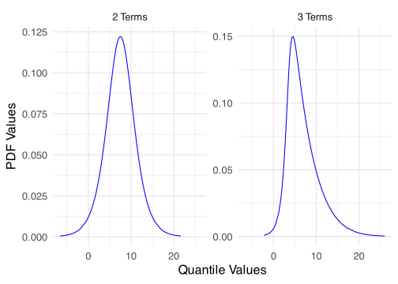
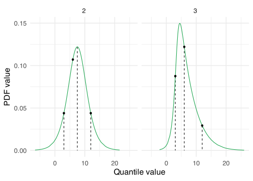
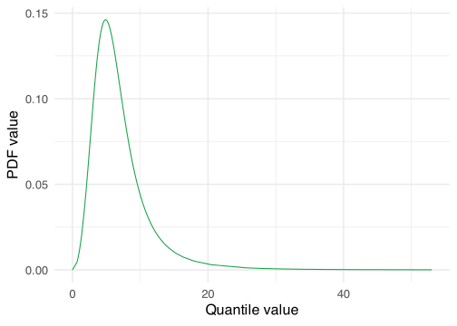
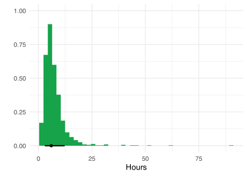

I recently discovered the metalog distribution via
[MakeDistribution](https://makedistribution.com/). According to
[Wikipedia](https://en.wikipedia.org/wiki/Metalog_distribution), the
metalog distribution “is a flexible continuous probability distribution
designed for ease of use in practice”. A distribution that was designed
to be easy to use peaked my interest, so in this blog post I try to
figure out how to use it and determine whether it is indeed a useful and
easy to use distribution.

Run the setup code below in case you want to follow along.

<details class="code-fold">
<summary>Code</summary>

``` r
library(tidyverse)
library(rmetalog)
library(magrittr)
library(ggdist)

theme_set(theme_minimal(base_size = 16))
primary <- "#16a34a"

metalog_to_df <- function(x) {
  metalog |>
    magrittr::use_series("M") |>
    tibble::as_tibble() |>
    tidyr::pivot_longer(
      cols = -y,
      names_to = c(".value", "term"),
      names_pattern = "(.)([1-9+])"
    ) |>
    dplyr::mutate(term = as.numeric(term)) |>
    dplyr::rename(
      quantile_value = M,
      pdf_value = m
    )
}
```

</details>

## The problem with distributions

A common problem with working with distributions is that you need to
know which distribution to use for which use-case and then shape the
distribution to your liking by giving the distribution’s parameters the
right values. In some cases this is fairly straightforward, like when
you want to model something as a normal distribution with a certain mean
and standard deviation.

But what if you want to model, say, how long you think a particular task
will take in hours? Here a normal distribution is not well suited and
instead you have to use something else, perhaps a Gamma distribution or
a lognormal distribution. These distributions take parameters other than
a mean and standard deviation and they don’t have much intuitive meaning
(at least not to me).

## Using the metalog distribution

The metalog distribution changes all of that because you can simply
specify the distribution by giving it a set of quantile-value pairs that
are used to form the distribution.

For example, let’s specify three quantile-value pairs below and see how
they shape the distribution.

We use the rmetalog package, which has a function called `metalog()` to
create the distribution. We give it the values, the quantiles, and a
term limit. The latter refers to how many terms are used in the
distribution, with larger term distributions having more flexibility,
meaning they better match the quantile-value pairs. The maximum number
of terms is the number of quantile-value pairs we give it, so in the
example below the maximum is 3.

<details open class="code-fold">
<summary>Code</summary>

``` r
values <- c(3, 6, 12)
quantiles <- c(0.1, 0.5, 0.9)

metalog <- metalog(
  x = values,
  prob = quantiles,
  term_limit = 3,
)

summary(metalog)
```

</details>

     -----------------------------------------------
     Summary of Metalog Distribution Object
     -----------------------------------------------
     
    Parameters
     Term Limit:  3 
     Term Lower Bound:  2 
     Boundedness:  u 
     Bounds (only used based on boundedness):  0 1 
     Step Length for Distribution Summary:  0.01 
     Method Use for Fitting:  any 
     Number of Data Points Used:  3 
     Original Data Saved:  FALSE 
     

     Validation and Fit Method
     term valid         method
        2   yes Linear Program
        3   yes Linear Program

Using `summary()` on the output of `metalog()` gives us some information
about the distribution, but it doesn’t seem particularly useful to me,
so let’s move on to visualizing the distribution using the `plot()`
function. Unfortunately, using `plot()` on the output returns two
plots—one showing the probability density function (PDF) and the other
one showing the cumulative density function (CDF). I prefer looking at
the PDF, so that’s the one I extract and plot below.

<details class="code-fold">
<summary>Code</summary>

``` r
p <- plot(metalog) |>
  use_series("pdf")

p
```

</details>



This shows us two PDF plots. By default the metalog function creates
multiple distributions with a different number of terms. In this case,
we get one with two terms and one with three terms. The graph with three
terms matches exactly the quantile-value pairs we specified but the one
with two terms doesn’t, which I’ll show below by calculating the PDFs at
specific quantile values manually using `dmetalog()` and `qmetalog()`,
which are equivalents of functions like `dnorm()` and `qnorm()`. I also
use some custom functions I loaded in the setup code to extract the
metalog values (quantile values and PDF values) as a data frame and plot
them using `ggplot()`.

<details class="code-fold">
<summary>Code</summary>

``` r
points <- tibble(
  quantile_value = values,
  pdf_value_2 = dmetalog(metalog, quantile_value, term = 2),
  pdf_value_3 = dmetalog(metalog, quantile_value, term = 3)
)

lines <- tibble(
  quantile_value_2 = qmetalog(metalog, quantiles, term = 2),
  quantile_value_3 = qmetalog(metalog, quantiles, term = 3),
  pdf_value_2 = dmetalog(metalog, quantile_value_2, term = 2),
  pdf_value_3 = dmetalog(metalog, quantile_value_3, term = 3),
)

points <- points |>
  pivot_longer(
    cols = -quantile_value,
    names_to = "term",
    values_to = "pdf_value",
    names_transform = parse_number
  )

lines <- lines |>
  pivot_longer(
    cols = everything(),
    names_to = c(".value", "term"),
    names_pattern = "(.+_.+)_([1-9]+)"
  ) |>
  mutate(term = as.numeric(term))

df <- metalog_to_df(metalog)

ggplot(df, aes(x = quantile_value, y = pdf_value)) +
  facet_wrap(~term) +
  geom_segment(data = lines, aes(yend = 0), linetype = "dashed") +
  geom_line(color = primary) +
  geom_point(data = points) +
  labs(x = "Quantile value", y = "PDF value")
```

</details>



The points show what the PDF values are at each of the quantiles we
specified (0.10, 0.50, and 0.90). The lines show the correct
quantile-value pairs (e.g., at quantile value 6 the total area of the
curve before that value should be 50%). We see that the distribution
with three terms perfectly matches our quantile-value pairs while the
one with two terms doesn’t. The one with two terms has two correct
quantile-value pairs (at 3 and 12), but one incorrect one (at 6). I
suppose this means that the distribution with the most terms will be a
closer match to the specified quantile-value pairs.

This is cool, though. By simply specifying three quantile-value pairs,
we obtained a distribution that matches those values, in this case
exactly. This means it becomes much easier to specify a distribution to
your liking.

## Does the distribution always match the specified quantile-value pairs?

Apparently, the answer is no. We can quickly check this using the
`qmetalog()` function to see whether it produces the same values we
provided as part of the quantile-value pairs. In the example below we
set the values to 3, 6, and 12, and the quantiles to 0.1, 0.5, and 0.9.
After running the the `metalog()` function, we can use the `qmetalog()`
function to reproduce the values after giving it the output of the
`metalog()` function and the quantiles.

<details class="code-fold">
<summary>Code</summary>

``` r
values <- c(3, 6, 12)
quantiles <- c(0.1, 0.5, 0.9)

metalog <- metalog(
  x = values,
  prob = quantiles,
  term_limit = 3,
)

qmetalog(metalog, quantiles, term = 3)
```

</details>

    [1]  3  6 12

In this example, the function returns the same values we specified in
the `values` variable, which means the distribution is a match. But
let’s slightly change the values in the quantile-value pairs and check
it again, for example by giving it the values 3, 4, and 12.

<details class="code-fold">
<summary>Code</summary>

``` r
values <- c(3, 4, 12)
quantiles <- c(0.1, 0.5, .9)

metalog <- metalog(
  x = values,
  prob = quantiles,
  term_limit = 3,
)

qmetalog(metalog, quantiles, term = 3)
```

</details>

    [1]  3.000000  4.499306 12.000000

Now the function returns values that are slightly different than the
values we provided, so the distribution is not an exact match. This
makes sense because the distribution is not fully customizable; it still
has some constraints that limits its flexibility.

If you want to use a distribution that is fully flexible, you have to
use other solutions. One such solution is
[MakeDistribution](https://makedistribution.com/). They offer other
types of distributions that can exactly match the quantile-value pairs,
although it’s not fully free to use. They also have an [R
package](https://github.com/tadamcz/make_distribution_r_client) to
access the (paid) API.

## Boundedness

The metalog distribution also supports setting bounds on the
distribution. This means you can specify what the minimum and/or maximum
value should be. Below I modify our existing metalog distribution by
specifying a lower bound of 0.

<details open class="code-fold">
<summary>Code</summary>

``` r
values <- c(3, 6, 12)
quantiles <- c(0.1, 0.5, 0.9)

metalog <- metalog(
  x = values,
  prob = quantiles,
  term_limit = 3,
  boundedness = "sl",
  bound = 0
)

df <- metalog_to_df(metalog)

df |>
  filter(term == 3) |>
  ggplot(aes(x = quantile_value, y = pdf_value)) +
  geom_line(color = primary) +
  labs(x = "Quantile value", y = "PDF value")
```

</details>



The distribution now starts at 0, perfect.

## Simulation

With the distribution specified to our liking, we can simulate values
from the distribution using the `rmetalog()` function. In the code below
I simulate 1000 values from the distribution and turn the values into a
data frame to plot them as a histogram. I also calculate the quantile
values at 10%, 50%, and 90%, which should roughly match the values we
specified previously (3, 6, and 12).

<details open class="code-fold">
<summary>Code</summary>

``` r
hours <- rmetalog(metalog, n = 1000, term = 3)

df <- tibble(hour = hours)

median_qi <- median_qi(hours, .width = .8)

ggplot(df, aes(x = hour)) +
  stat_histinterval(.width = .8, fill = primary) +
  labs(x = "Hours", y = "")
```

</details>



Excellent, we now have a distribution that you could say represents the
number of hours to complete a task. We could use this to model how long
a project would take to complete by creating separate distributions for
each task, sampling values from them, and then summing them together to
get a view of how long it will take to complete the project.

## Summary

The metalog distribution makes it easy to specify a distribution using
only quantile-value pairs. You can use the `metalog()` function from the
the rmetalog package to specify the distribution, including whether the
distribution is bounded or not, and then simulate values from this
distribution using the `rmetalog()` function.
