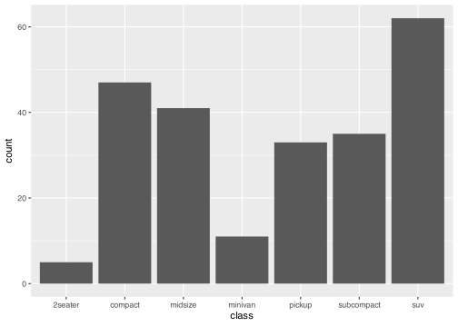
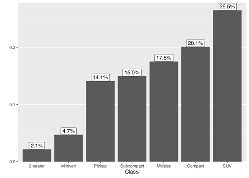
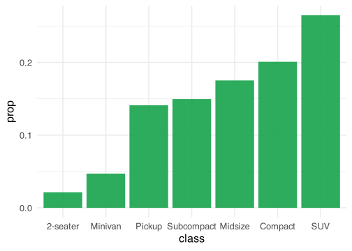

In this blog post I want to take a standard bar plot and build on it
step-by-step to make it better looking and more informative.

<details open class="code-fold">
<summary>Code</summary>

``` r
library(tidyverse)
library(scales)
```

</details>

## Data

<details open class="code-fold">
<summary>Code</summary>

``` r
head(mpg)
```

</details>

| manufacturer | model | displ | year | cyl | trans      | drv | cty | hwy | fl  | class   |
|:-------------|:------|------:|-----:|----:|:-----------|:----|----:|----:|:----|:--------|
| audi         | a4    |   1.8 | 1999 |   4 | auto(l5)   | f   |  18 |  29 | p   | compact |
| audi         | a4    |   1.8 | 1999 |   4 | manual(m5) | f   |  21 |  29 | p   | compact |
| audi         | a4    |   2.0 | 2008 |   4 | manual(m6) | f   |  20 |  31 | p   | compact |
| audi         | a4    |   2.0 | 2008 |   4 | auto(av)   | f   |  21 |  30 | p   | compact |
| audi         | a4    |   2.8 | 1999 |   6 | auto(l5)   | f   |  16 |  26 | p   | compact |
| audi         | a4    |   2.8 | 1999 |   6 | manual(m5) | f   |  18 |  26 | p   | compact |

## Step 1: Basic bar plot

<details open class="code-fold">
<summary>Code</summary>

``` r
ggplot(mpg, aes(x = class)) +
  geom_bar()
```

</details>



## Step 2: Prepare the data

It’s more desirable to calculate the statistics ourselves, for various
reasons.

One, by first calculating the statistics we want to show we don’t need
to ask ggplot2 to calculate the statistics for us, which in certain
cases can reduce the amount of code.

Two, we often need to turn some columns in the data into a factor,
usually based on another value. For example, if we want to set the
factor levels in order of the proportion of each class, we can do that
by first calculating the proportion and then using `fct_reorder()` to
sort the levels by the proportion. This can also be done while writing
the ggplot code, but that will quickly make the code look more bloated.

<details open class="code-fold">
<summary>Code</summary>

``` r
class_props <- mpg |>
  count(class) |>
  mutate(
    prop = n / sum(n),
    class = case_match(
      class,
      "2seater" ~ "2-seater",
      "suv" ~ "SUV",
      .default = str_to_sentence(class)
    ),
    class = fct_reorder(class, prop)
  )

ggplot(class_props, aes(x = class, y = prop)) +
  geom_col()
```

</details>



## Step 4: Add percentages

<details open class="code-fold">
<summary>Code</summary>

``` r
ggplot(class_props, aes(x = class, y = prop)) +
  geom_col() +
  scale_y_continuous(labels = percent_format(accuracy = 1)) +
  labs(y = "")
```

</details>



## Step 4: Add and/or remove labels

<details open class="code-fold">
<summary>Code</summary>

``` r
ggplot(class_props, aes(x = class, y = prop)) +
  geom_col() +
  geom_label(aes(label = percent(prop, 0.1)), vjust = 0) +
  scale_y_continuous(labels = percent_format(accuracy = 1)) +
  labs(y = "")
```

</details>


<details open class="code-fold">
<summary>Code</summary>

``` r
ggplot(class_props, aes(x = class, y = prop)) +
  geom_col() +
  geom_label(aes(label = percent(prop, 0.1)), vjust = 0) +
  labs(x = "Class", y = "") +
  scale_y_continuous(expand = expansion(c(0, 0.05))) +
  theme(panel.grid.major.x = element_blank())
```

</details>


## Step X: Default settings

<details open class="code-fold">
<summary>Code</summary>

``` r
# Set the default ggplot theme and geom defaults
base_size <- 16
primary <- "#16a34a"
gray <- "gray20"

theme_set(theme_minimal(base_size = base_size))

update_geom_defaults("col", list(alpha = .9, linewidth = .25, fill = primary))
update_geom_defaults("label", list(size = (base_size * .8) / .pt, color = gray))

geom_label <- function(
    ...,
    label.size = NA,
    label.padding = unit(.25, "lines")) {
  ggplot2::geom_label(
    ...,
    label.size = label.size,
    label.padding = label.padding
  )
}

ggplot(class_props, aes(x = class, y = prop)) +
  geom_col()
```

</details>


