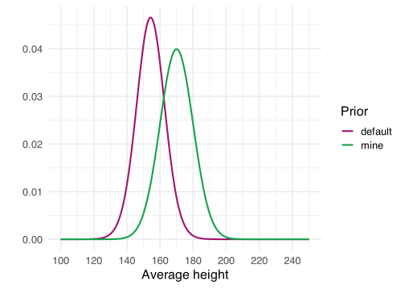
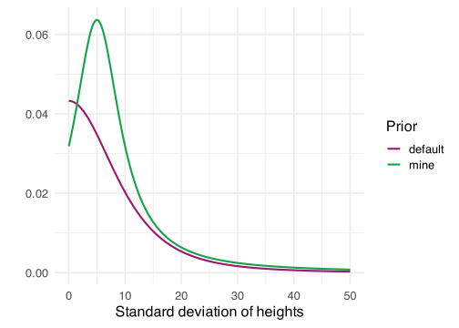
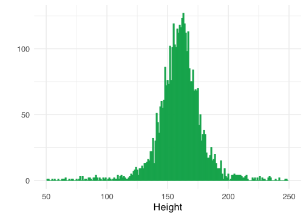
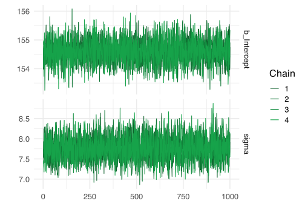
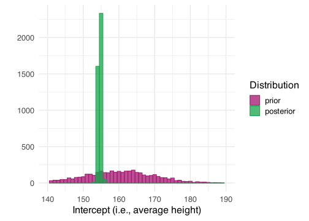
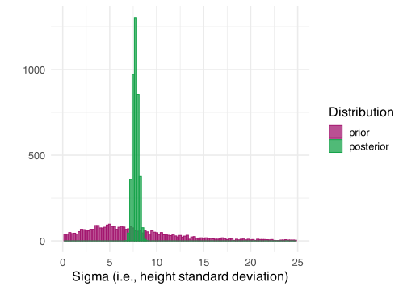
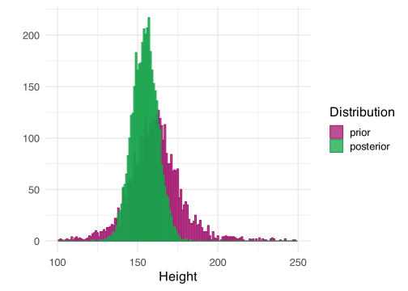

This post is the first of a series of tutorial posts on Bayesian
statistics. I’m not an expert on this topic, so this tutorial is partly,
if not mostly, a way for me to figure it out myself.

The goal will be to go through each step of the data analysis process
and make things as intuitive and clear as possible. I’ll use the brms
package to run the models and I will rely heavily on the book
<a href="https://xcelab.net/rm/statistical-rethinking/" target="_blank"
title="Statistical Rethinking website">Statistical Rethinking</a> by
Richard McElreath.

The basic idea behind Bayesian statistics is that we start off with
prior beliefs about the parameters in the model and then update those
parameter beliefs using data. That means that for all models you need to
figure out what your beliefs are before running any analyses. This is
very different from frequentist statistics and probably the most
off-putting part of running Bayesian analyses. However, my goal is to
make this relatively easy by focusing on visualizing priors and how they
change as a function of the Bayesian process. I’ll also try to come up
with some methods to simplify the construction of priors, with the goal
to have them be reasonable and non-controversial.

In some cases I might not even use a prior I personally believe in.
Instead I’ll use a prior that represents a particular position or
skepticism so that the results of the analysis can be used to change the
mind of the skeptic, rather than me changing whatever I happen to
believe.

With this in mind, let’s begin.

## Setup

In the code chunk below I show some setup code to get started, starting
with the packages. After loading the packages I set the default ggplot2
theme and some colors. Finally, I set several brms specific options to
speed up the functions and automatically re-run models if a model has
changed. If a model has not changed, the results will be read from a
file instead of re-running the model.

<details class="code-fold">
<summary>Code</summary>

``` r
library(tidyverse)
library(brms)
library(tidybayes)
library(modelr)

theme_set(theme_minimal(base_size = 16))
primary <- "#16a34a"
secondary <- "#A3166F"
palette <- c(primary, "#138d40", "#107636", "#0d602b")

options(
  mc.cores = 4,
  brms.threads = 4,
  brms.backend = "cmdstanr",
  brms.file_refit = "on_change"
)
```

</details>

## Data

The <a href="www.willemsleegers.com/data/Howell1.csv"
target="_blank">data</a> I’ll use is the same data Richard McElreath
uses in Chapter 4 of his amazing book Statistical Rethinking. The data
consists of partial census data of the !Kung San, compiled from
interviews conducted by Nancy Howell in the late 1960s. Just like in the
book, I will focus only on people 18 years or older.

<details class="code-fold">
<summary>Code</summary>

``` r
data <- read_csv("Howell1.csv")
data <- filter(data, age >= 18)

head(data)
```

</details>

|  height |   weight | age | male |
|--------:|---------:|----:|-----:|
| 151.765 | 47.82561 |  63 |    1 |
| 139.700 | 36.48581 |  63 |    0 |
| 136.525 | 31.86484 |  65 |    0 |
| 156.845 | 53.04191 |  41 |    1 |
| 145.415 | 41.27687 |  51 |    0 |
| 163.830 | 62.99259 |  35 |    1 |

## An intercept-only model

Let’s focus the first question on the heights in the data. What are the
heights of the Dobe area !Kung San?

The way to address this question is by constructing a model in which
heights are regressed on only the intercept, i.e., an intercept-only
model. You may be familiar with the R formula for this type of model:
`height ~ 1`.

With this formula and the data we can use brms to figure out which
priors we need to set by running the `get_prior()` function. This is
probably the easiest way to figure which priors you need when you’re
just starting out using brms.

<details class="code-fold">
<summary>Code</summary>

``` r
get_prior(height ~ 1, data = data)
```

</details>

| prior                    | class     | coef | group | resp | dpar | nlpar | lb  | ub  | source  |
|:-------------------------|:----------|:-----|:------|:-----|:-----|:------|:----|:----|:--------|
| student_t(3, 154.3, 8.5) | Intercept |      |       |      |      |       |     |     | default |
| student_t(3, 0, 8.5)     | sigma     |      |       |      |      |       | 0   |     | default |

The output shows us that we need to set two priors, one for the
Intercept and one for sigma. brms already determined a default prior for
each parameter (they are required for a Bayesian analysis), so we could
immediately run an analysis if we want to but it is recommended to
construct your own priors because you can often do better than the
default priors.

Also, using the `get_prior()` function is not the best way to think
about which priors we need. Using the function will give us the answer,
but it doesn’t really improve our understanding of why these two priors
are needed. In this case I also omitted an important specification of
the heights, which is that they are normally distributed (the default in
`get_prior()`). So let’s instead write down the model in a different
way, which explicitly specifies how we think the heights are distributed
and which parameters we need to set priors on. If we think the heights
are normally distributed, we define our model like this:

<math> $$heights_i ∼ Normal(\mu, \sigma)$$ </math>

We explicitly note that the individual heights come from a normal
distribution, which is determined by the parameters <math>$\mu$</math>
and <math>$\sigma$</math>. This then also immediately tells us that we
need to set two priors, one on <math>$\mu$</math> and one on
<math>$\sigma$</math>.

In our intercept-only model, the <math>$\mu$</math> parameter refers to
our intercept and the <math>$\sigma$</math> parameter refers to, well,
sigma. Sigma is not often discussed in the literature I’m familiar with,
but we’ll figure it out below. In fact, let’s discuss each of these
parameters in turn and figure out what kind of prior makes sense.

## The intercept (<math>$\mu$</math>) prior

The prior for the intercept refers to, in this case, the *average*
height of the !Kung San.

brms has set the default intercept prior as a Student *t*-distribution
with 3 degrees of freedom, a mean of 154.3 and a standard deviation of
8.5. That means brms starts off with a ‘belief’ that the average of the
heights is 154.3, but with quite some uncertainty reflected in the
standard deviation of 8.5 and the fact that the distribution is a
Student *t*-distribution. A Student *t*-distribution has thicker tails
compared to a normal distribution, meaning that numbers in the tails of
the distribution are more likely compared to a normal distribution, at
least when the degrees of freedom are low. At higher degrees of freedom,
the *t*-distribution becomes more and more like the normal distribution.
So, the thicker tails of the *t*-distributions means smaller and taller
average heights are relatively more plausible.

But this is the default prior. brms determines this prior by peeking at
the data to create a weak prior that is easily updated by the data. We
can do a bit better than the default prior, though.

What do I believe the average height to be? As a Dutch person, I might
think that the average height is around 175 centimeters. This is
probably too tall to use as an average for the !Kung San because we’re
known for being quite tall. So I think the average should be lower than
175, perhaps 170. I am not very sure, though. After all, I am far from
an expert on people’s heights; I am only using my layman knowledge here.
An average of 165 seems possible to me too. So let’s describe my belief
in the form of a distribution in which multiple averages are possible,
to varying extents. We could use a Student *t*-distribution with small
degrees of freedom if we want to allow for the possibility of being very
wrong (remember, it has thicker tails, so it assigns more probability to
a wider range of average heights). We’re not super uncertain about
people’s heights, though, so let’s use a normal distribution.

As we saw in defining our height model, a normal distribution requires
that we set two parameters: the <math>$\mu$</math> and the
<math>$\sigma$</math>. The <math>$\mu$</math> we already covered (i.e.,
170), so that leaves <math>$\sigma$</math>. Let’s set this to 10 and see
what happens by visualizing this prior. Below I plot both the default
brms prior and our own with <math>$\mu$</math> = 170 and
<math>$\sigma$</math> = 10.

<details class="code-fold">
<summary>Code</summary>

``` r
height_prior_intercept <- tibble(
  height_mean = seq(from = 100, to = 250, by = 0.1),
  mine = dnorm(height_mean, mean = 170, sd = 10),
  default = dstudent_t(height_mean, df = 30, mu = 154.3, sigma = 8.5)
)

height_prior_intercept <- pivot_longer(
  height_prior_intercept,
  cols = -height_mean,
  names_to = "prior"
)

ggplot(
  height_prior_intercept,
  aes(x = height_mean, y = value, color = prior)
) +
  geom_line(linewidth = 1) +
  labs(x = "Average height", y = "", color = "Prior") +
  scale_x_continuous(breaks = seq(100, 250, 20)) +
  scale_color_manual(values = c(secondary, primary))
```

</details>



My prior indicates that I believe the average height to be higher than
the default prior. In terms of the standard deviation, we both seem to
be about equally uncertain about this average. Looking at this graph I
think this prior of mine is not very plausible. Apparently I assign
quite a chunk of plausibility to an average of 180 cm, or even 190 cm,
which is very unlikely. An average of 160 cm is more plausible to me
than an average of 180, so I should probably lower the mu, or use more
of a skewed distribution. This is one of the benefits of visualizing the
prior, it can make you think again about your prior so that you may
improve on it. Based on the graph, a value of 160 seems more reasonable,
so in the next model I’ll us this value. I can probably also lower the
standard deviation, but I’ll leave it at 10 to show how easily the data
will update this prior.

## The sigma (<math>$\sigma$</math>) prior

What about the sigma prior? What even is sigma? Sigma is the estimated
standard deviation of the errors or, in other words, the standard
deviation of the residuals of the model. In the simple case of an
intercept-only model, this is identical to the standard deviation of the
outcome (heights, in this case).

I think setting the standard deviation of the distribution of heights
(not the mean of the heights) is quite difficult. There are parts that
are easy, such as the fact that the standard deviation has to be 0 or
larger (it can’t be negative), but exactly how large it should be, I
don’t know.

I do know it is unlikely to be close to 0, and unlikely to be very
large. That’s because I know people’s heights do vary, so I know the
sigma can’t be 0. I also know it’s not super large because we don’t see
people who are taller than 2 meters very often. This means the peak of
our prior should be somewhere above 0, with a tail to allow higher
values but not too high. We can use a normal distribution for this with
a mean above 0 and a particular standard deviation, and ignore
everything that’s smaller than 0 (brms automatically ignores negative
values for <math>$\sigma$</math>).

As I mentioned before, there is a downside of using a normal
distribution, though. Normal distributions have long tails, but there is
actually very little density in those tails. If we are quite uncertain
about our belief about sigma, we should use a *t*-distribution, or
perhaps even a cauchy distribution (actually, the cauchy distribution is
a special case of the *t*-distribution; they are equivalent if the
degree of freedom is 1). The lower the degrees of freedom, the more
probability we assign to higher and lower values.

A *t*-distribution requires three parameters: <math>$\mu$</math>,
<math>$\sigma$</math>, and the degrees of freedom. I set
<math>$\mu$</math> to 5, <math>$\sigma$</math> to 5, and the degrees of
freedom to 1. Below I plot this prior and brms’s default prior to get a
better grasp of these priors.

<details class="code-fold">
<summary>Code</summary>

``` r
height_prior_sigma <- tibble(
  height_sigma = seq(from = 0, to = 50, by = .1),
  default = dstudent_t(height_sigma, df = 3, mu = 0, sigma = 8.5),
  mine = dstudent_t(height_sigma, df = 1, mu = 5, sigma = 5)
)

height_prior_sigma <- pivot_longer(
  height_prior_sigma,
  cols = -height_sigma,
  names_to = "prior"
)

ggplot(
  height_prior_sigma,
  aes(x = height_sigma, y = value, color = prior)
) +
  geom_line(linewidth = 1) +
  labs(x = "Standard deviation of heights", y = "", color = "Prior") +
  scale_color_manual(values = c(secondary, primary))
```

</details>



As you can see, both distributions have longish tails, allowing for the
possibility of high standard deviations. There are some notable
differences between the two priors, though. My prior puts more weight on
a standard deviation larger than 0, while the default prior reflects a
belief in which a standard deviation of 0 is most likely. However, both
priors are quite weak.

## Prior predictive check

So far we have inspected each prior in isolation, but we can also use
our priors to simulate heights and see if the distribution of heights
makes sense. This is called a prior predictive check.

We can perform a prior predictive check using the `brm()` function from
brms.The `brm()` function is the main work horse of the brms package. It
enables us to run Bayesian analyses by using a common notation style
familiar to those who use R. This is also one of the reasons why the
brms package is so great; it’s very easy to get started with running
Bayesian analyses.

The `brm()` function requires a model specification and the data.
Optionally, but usefully, we should also specify the response
distribution (a normal distribution by default) and the priors.

However, we’re not ready to actually run the model just yet. Instead, we
will kinda trick brms into running an analysis, but tell it to only
sample from the prior using the `sample_prior` argument. This will give
us ‘predicted’ responses based entirely on our priors and not the data.

Additionally, we also set a seed to make the results reproducible and a
file to store the results into so that if we run the analysis again, we
can simply read the results from the file rather than running the
analysis again. I will also set the `silent` argument to 2 to hide some
logs that aren’t useful.

<details class="code-fold">
<summary>Code</summary>

``` r
model_height_prior <- brm(
  formula = height ~ 1,
  data = data,
  family = gaussian,
  prior = c(
    prior(normal(160, 10), class = "Intercept", lb = 0, ub = 250),
    prior(cauchy(5, 5), class = "sigma")
  ),
  sample_prior = "only",
  seed = 4,
  file = "models/model_height_prior.rds"
)
```

</details>

The next part is a little tricky. The goal is to obtain a large sample
of predicted heights so we can visualize its distribution. By default,
brms will draw 4000 draws to approximate distributions. We could use the
`predict()` function to get these draws (e.g.,
`predict(model_height_prior)`, but I prefer to use the tidybayes package
because it’s a really nice package that simplifies a lot of things about
working with brms models.

The tidybayes function I’ll use is `add_predicted_draws()`. The function
takes a data frame and a model object. The function adds predictions for
each row in the data frame. This is kinda tricky because we only have an
intercept-only model. If you have predictors in the model you could give
the function a data frame with values for each predictor that you want
to obtain predicted values for. We don’t have that, so we need to give
it an empty data frame. To simplify this, we’ll use a function from the
modelr package called `data_grid()`. This function can be used to
construct a data frame with predictors from the model. In this case we
don’t have any predictors, but we can still specify the model. It will
then create an empty data frame for us that we can add predictions to.
Note that this means the data frame starts off empty but we then add
draws to the data frame, creating a larger data frame.

After obtaining the draws, I plot the draws using a simple histogram.

<details class="code-fold">
<summary>Code</summary>

``` r
heights_prior <- data_grid(.model = model_height_prior) |>
  add_predicted_draws(model_height_prior, value = "height")

ggplot(heights_prior, aes(x = height)) +
  geom_histogram(binwidth = 1, color = primary, fill = primary) +
  labs(x = "Height", y = "") +
  scale_x_continuous(limits = c(50, 250))
```

</details>



Our priors result in a normal distribution of heights with the bulk of
the observations ranging from about 120 cm to 205 cm. That seems fairly
reasonable to me, as someone who doesn’t know too much about the heights
of the !Kung San.

## Running the model

Now that the priors are in order we can run the model with the code
below. Notice that this time I omit the `sample_prior` argument so we
only obtain the posterior results.

<details class="code-fold">
<summary>Code</summary>

``` r
model_height <- brm(
  formula = height ~ 1,
  data = data,
  family = gaussian,
  prior = c(
    prior(normal(160, 10), class = "Intercept"),
    prior(cauchy(5, 5), class = "sigma")
  ),
  seed = 4,
  file = "models/model_height.rds"
)
```

</details>

After running the model, we first check whether the chains look like
caterpillars because that indicates we have samples from the entire
distribution space of the posteriors. I use the `tidy_draws()` function
below to get the draws of each parameter and the chain information
(e.g., which draw is from which chain) to create my own plot, but you
can also simply use `plot(model_height)`.

<details class="code-fold">
<summary>Code</summary>

``` r
model_height |>
  tidy_draws() |>
  pivot_longer(cols = c(b_Intercept, sigma)) |>
  mutate(.chain = factor(.chain)) |>
  ggplot(aes(x = .iteration, y = value, color = .chain)) +
  geom_line() +
  facet_grid(rows = vars(name), scales = "free") +
  labs(x = "", y = "", color = "Chain") +
  scale_color_manual(values = rev(palette))
```

</details>



The chains look good.

We can call up the estimates and the 95% confidence intervals by
printing the model object. Do note that the confidence intervals don’t
have the same meaning as frequentist confidence intervals. The intervals
here simply indicate what the most likely values are (given the model,
priors, and data). By default, the function returns 95% intervals,
meaning that 95% of the draws are between the lower and upper bounds.

<details class="code-fold">
<summary>Code</summary>

``` r
summary(model_height)
```

</details>

     Family: gaussian 
      Links: mu = identity; sigma = identity 
    Formula: height ~ 1 
       Data: data (Number of observations: 352) 
      Draws: 4 chains, each with iter = 2000; warmup = 1000; thin = 1;
             total post-warmup draws = 4000

    Regression Coefficients:
              Estimate Est.Error l-95% CI u-95% CI Rhat Bulk_ESS Tail_ESS
    Intercept   154.61      0.41   153.81   155.40 1.00     3706     2957

    Further Distributional Parameters:
          Estimate Est.Error l-95% CI u-95% CI Rhat Bulk_ESS Tail_ESS
    sigma     7.75      0.30     7.20     8.36 1.00     3319     2167

    Draws were sampled using sample(hmc). For each parameter, Bulk_ESS
    and Tail_ESS are effective sample size measures, and Rhat is the potential
    scale reduction factor on split chains (at convergence, Rhat = 1).

Here we see the Intercept and sigma estimates. Apparently our posterior
estimate for the Intercept is 154.61 and the estimate for
<math>$\sigma$</math> is 7.75. We also see the 95% CIs, but let’s
visualize these results instead.

Inspecting the chains also showed us the posterior distributions of the
two parameters, but let’s create our own graphs that compare both the
prior and posterior distributions. We can use the `spread_draws()`
function from tidybayes to get draws from each parameter in the model.
In the code below I do that twice, once to get the draws from our
previous model that sampled from the prior only and once from our new
model. The result for each is a data frame and I’ll add a column to
indicate whether the draw is from the prior or posterior. If you don’t
know what the parameters are called, you can use the `get_variables()`
function to get a list of the names you can extract draws from.

<details class="code-fold">
<summary>Code</summary>

``` r
draws_prior <- model_height_prior |>
  spread_draws(b_Intercept, sigma) |>
  mutate(distribution = "prior")

draws_posterior <- model_height |>
  spread_draws(b_Intercept, sigma) |>
  mutate(distribution = "posterior")

draws <- bind_rows(draws_prior, draws_posterior) |>
  mutate(distribution = fct_relevel(distribution, "prior"))

ggplot(draws, aes(x = b_Intercept, color = distribution, fill = distribution)) +
  geom_histogram(binwidth = 1, position = "identity", alpha = .75) +
  labs(
    x = "Intercept (i.e., average height)",
    y = "",
    color = "Distribution",
    fill = "Distribution"
  ) +
  scale_x_continuous(limits = c(140, 190)) +
  scale_color_manual(values = c(secondary, primary)) +
  scale_fill_manual(values = c(secondary, primary))
```

</details>



Here we see that the posterior distribution of average heights is much
more narrow and centered around 155 cm. So not only should we switch
from thinking the average is lower than 160, we can also be much more
confident about the mean.

How about sigma?

<details class="code-fold">
<summary>Code</summary>

``` r
ggplot(draws, aes(x = sigma, color = distribution, fill = distribution)) +
  geom_histogram(binwidth = 0.25, position = "identity", alpha = .75) +
  labs(
    x = "Sigma (i.e., height standard deviation)",
    y = "",
    color = "Distribution",
    fill = "Distribution"
  ) +
  scale_x_continuous(limits = c(0, 25)) +
  scale_color_manual(values = c(secondary, primary)) +
  scale_fill_manual(values = c(secondary, primary))
```

</details>



Similarly, we see that the posterior for sigma is also much more narrow
and around 8.

A final step is to conduct a posterior predictive check. Since we also
conducted a prior predictive check we can plot both and compare how our
overall beliefs about the distribution of heights should change as a
function of the data. Below I create a new data frame with draws from
the posterior, just like when I created the prior predictive check, and
merge it with the prior data frame from before.

<details class="code-fold">
<summary>Code</summary>

``` r
heights_posterior <- data_grid(.model = model_height) |>
  add_predicted_draws(model_height, value = "height") |>
  mutate(distribution = "posterior")

heights_prior <- mutate(heights_prior, distribution = "prior")

heights <- bind_rows(heights_prior, heights_posterior) |>
  mutate(distribution = fct_relevel(distribution, "prior"))

ggplot(heights, aes(x = height, color = distribution, fill = distribution)) +
  geom_histogram(binwidth = 1, position = "identity", alpha = .75) +
  labs(x = "Height", y = "", color = "Distribution", fill = "Distribution") +
  scale_x_continuous(limits = c(100, 250)) +
  scale_color_manual(values = c(secondary, primary)) +
  scale_fill_manual(values = c(secondary, primary))
```

</details>



This is one of my favorite plots. It shows how we started with a belief
about heights and what our new belief should be, after seeing the data.
That is the main goal of doing data analysis.

## Summary

In this post I showed how to run an intercept-only model in brms. It
consisted of the following steps:

1.  Define the model
2.  Use the model to figure out which priors to set
3.  Visualize the priors and create a prior predictive check to
    potentially tweak the priors (using brms)
4.  Run the model
5.  Inspect the output, including the chains
6.  Obtain draws of the estimates and visualize their distribution
7.  Compare the prior predictive check to the posterior results to see
    how much to update based on the data

In the next post I’ll show how to add a predictor to the model.
