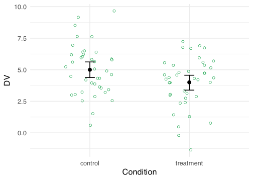
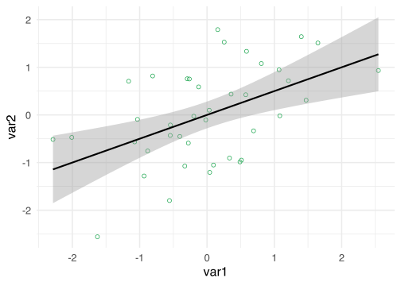
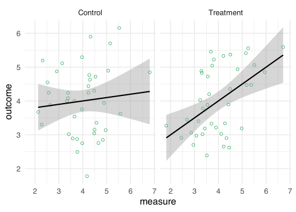

## Introduction

Doing power analyses is hard. I know this from experience, both as a
researcher and as a reviewer. As a researcher, I have found power
analyses to be difficult because performing a good power analysis
requires a thorough understanding of the (hypothesized) data.
Understanding one’s data is often underestimated. We’re very quick to
design a study and start data collection, without often knowing what
various aspects of our data will look like (e.g., likely correlations
between measures, likely standard deviations). As a reviewer, I see that
power analyses are difficult because of wrong ideas about what a power
analysis actually means. The most common misconception I see is that
researchers think they should power their study, rather than the set of
analyses they will conduct (see @maxwell2004 for more on this). I also
see a lot of power analyses conducted with G\*Power, which sometimes
looks fine, but oftentimes produces results I know to be wrong (usually
involving interaction tests). So what to do?

My favorite way to run power analyses is via simulation.
Simulation-based power analyses are more difficult and take longer to
setup and run, but they’re more pedagogical. Simulations require you to
understand your data because you have to define the exact parameters
that define your data set (e.g., means, standard deviations,
correlations). It also creates a very intuitive understanding of what
power is: Power is simply counting how often you find the results you
expect to find.

Still, running simulation-based power analyses might be too difficult
for some. So in this blog post I present code to simulate data for a
range of different scenarios.

## Setup

Run the following code to get started. The most important package here
is MASS. It contains a function called `mvrnorm()` that enables us to
simulate data from a multivariate normal distribution. This means we’ll
simulate data for scenarios where we have a continuous outcome. I really
like this function for simulating data because it has an argument called
`empirical` that you can set to `TRUE`, which causes your simulated data
to have the exact properties you set (e.g., exactly a mean of 4). This
is a great way to check out your simulated data and see if it makes
sense.

We will use the tidyverse because we need to prepare the data after
simulating it. `mvrnorm()` returns a matrix with each simulated variable
as a column. This means we sometimes need to prepare the data so that we
can perform the tests we want to run or visualize the data.

The effectsize package will be used to inspect the data by calculating
standardized effect sizes. This will allow us to check whether the
parameters are plausible.

Finally, we sometimes use the broom package to extract p-values from the
statistical tests that we’ll run. This will be necessary to calculate
the power because power is (usually) nothing more than the number of
significant p-values divided by the number of tests we simulated data
for. In a future post I might focus on Bayesian analyses, so we won’t be
dealing with p-values then, although the logic will be the same.

Besides loading packages, we also set the `s` variable. The value of
this variable will determine how many times we’ll simulate the data
during the power analysis. The higher this number, the more accurate our
power estimates will be.

<details open class="code-fold">
<summary>Code</summary>

``` r
library(MASS)
library(tidyverse)
library(effectsize)
library(broom)

theme_set(theme_minimal(base_size = 16))
primary <- "#16a34a"

options(
  knitr.kable.NA = "",
  digits = 2
)

# Set number of loops in the power simulations
s <- 1000
```

</details>

With the setup out of the way, let’s cover our general approach to power
analyses:

1.  Simulate the data with fixed properties
2.  Check the data to see if the data is plausible
3.  Run the tests we want to run on the data
4.  Repeat steps 1 to 3 many times, save the p-values, and calculate
    power

We’ll do this for various scenarios. In each scenario we start by
defining the parameters. I’ll focus on providing means, standard
deviations, and correlations, because those are usually the parameters
we report in the results section, so I’m guessing most researchers will
have some intuitions about what these parameters mean and whether their
values are plausible.

The `mvrnorm()` function requires that we pass it the sample size, the
means, and a variance-covariance matrix. The first two are easy to
understand, but the variance-covariance may not be. It’s relatively
straightforward to convert means, SDs, and correlations to a
variance-covariance matrix, though. Variance is simply the standard
deviation squared and the covariance is the product of the standard
deviations of the two variables and their correlation. You’ll see in
some scenarios below that this is how I construct the
variance-covariance matrix.

Note that the result of each power analysis will be the power, and not
the sample size needed to obtain a particular power. This is the same as
calculating the post-hoc power in G\*Power. If you want to figure out
what the sample size is for a particular power (e.g., 80%) then you
simply change the sample size parameter until you have the power you
want.

## One sample *t*-test

The simplest scenario is where we want to simulate a set of normally
distributed values and perform a one sample *t*-test. This requires that
we set three parameters: a mean, a standard deviation, and a sample
size. We give `mvrnorm()` the sample size (`N`), the mean (`M`), and the
variance (`SD^2`). After simulating the data, we give the simulated data
a column name and convert the matrix returned by `mvrnorm()` to a data
frame.

<details open class="code-fold">
<summary>Code</summary>

``` r
# Parameters
M <- 0.75
SD <- 5
N <- 90

# Simulate once with empirical = TRUE
samples <- mvrnorm(N, mu = M, Sigma = SD^2, empirical = TRUE)

# Prepare data
colnames(samples) <- "DV"
data <- as_tibble(samples)
```

</details>

The next step is to inspect the data to see whether the parameters are
plausible. This can be done by converting the parameters to a
standardized effect size and by visualizing the data.

<details open class="code-fold">
<summary>Code</summary>

``` r
# Calculate a standardized effect size
effect_size <- cohens_d(data$DV)

# Plot the simulated data
ggplot(data, aes(x = DV)) +
  geom_histogram(color = primary, fill = primary) +
  geom_vline(xintercept = M, linetype = "dashed")
```

</details>


The histogram roughly shows that we have a mean of 0.75 and a standard
deviation of 5. We also calculated the Cohen’s *d* as a measure of the
size of the effect. The size of this effect is equal to a Cohen’s *d* of
0.15.

Next is the analysis we want to power for—the one-sample *t*-test. The
function for this test is `t.test()`.

<details open class="code-fold">
<summary>Code</summary>

``` r
t.test(data$DV)
```

</details>

To calculate the power, we repeat the analysis `s` times. Each time we
store the *p*-value so that later we can calculate the proportion of
significant results. Since we don’t need to inspect the data each time,
we skip the data preparation step and use the samples returned by
`mvrnorm()` immediately in `t.test()` using R’s matrix notation (if you
want, you can also prepare the data each time, if you find that easier
to understand).

<details open class="code-fold">
<summary>Code</summary>

``` r
# Create a vector to the store p-values in
p_values <- vector(length = s)

# Loop s times
for (i in 1:s) {
  # Simulate
  samples <- mvrnorm(N, mu = M, Sigma = SD^2)

  # Run test
  test <- t.test(samples[, 1])

  # Extract and store the p-value
  p_values[i] <- test$p.value
}

# Calculate power
power <- sum(p_values <= .05) / s * 100
```

</details>

With the current parameters (N = 90, Cohen’s *d* = 0.15), we obtain a
power of 27.2%. The power is simply how often we find a significant
result, divided by the number of times we looped, multiplied by 100 to
give a percentage. You can adjust the sample size parameter and re-run
the code until you know which sample size gives you the desired power.
You might also want to run the loop a few times to see how consistent
your results are (if the results are inconsistent, increase the number
of loops by increasing the value of `s`).

## Welch’s two sample *t*-test

The next scenario is one in which there are two groups (e.g., a control
condition and a treatment condition) and a single DV. Even in this
simple scenario there are already several variations that are important
to consider. Do we assume equal variances between groups? Do we assume
equal samples sizes? Is the design between or within-subjects? We’ll
start with assuming unequal variances between the two groups. This means
we’ll run a Welch’s two sample *t*-test. To make it extra fun, we’ll
also simulate unequal sample sizes.

If we are interested in a between-subjects design where we assume both
unequal variances and samples sizes, we can use the code from the
previous scenario and simply run it twice, once for each group. After
simulating the data, we convert the simulated matrix of each group to a
data frame, add a column indicating the group, and merge the two groups
into a single data frame.

<details open class="code-fold">
<summary>Code</summary>

``` r
# Parameters
M_control <- 5
M_treatment <- 4
SD_control <- 1.5
SD_treatment <- 3
N_control <- 50
N_treatment <- 40

# Simulate once with empirical = TRUE
control <- mvrnorm(N_control,
  mu = M_control, Sigma = SD_control^2,
  empirical = TRUE
)
treatment <- mvrnorm(N_treatment,
  mu = M_treatment, Sigma = SD_treatment^2,
  empirical = TRUE
)

# Prepare data
colnames(control) <- "DV"
colnames(treatment) <- "DV"

control <- control %>%
  as_tibble() %>%
  mutate(condition = "control")

treatment <- treatment %>%
  as_tibble() %>%
  mutate(condition = "treatment")

data <- bind_rows(control, treatment)
```

</details>

Next, we inspect the data by calculating a Cohen’s *d* and visualizing
the results.

<details open class="code-fold">
<summary>Code</summary>

``` r
# Calculate a standardized effect size
effect_size <- cohens_d(DV ~ condition, data = data, pooled_sd = FALSE)

# Visualize the data
ggplot(data, aes(x = condition, y = DV)) +
  geom_jitter(color = primary, height = 0, width = .25, shape = 21, size = 2) +
  stat_summary(
    fun.data = "mean_cl_boot", geom = "errorbar",
    width = .1, linewidth = 0.75
  ) +
  stat_summary(fun = "mean", geom = "point", size = 3) +
  labs(x = "Condition")
```

</details>


The difference between the two groups is equal to a Cohen’s d of 0.42.

To run a Welch’s two-sample *t*-test, we again use the `t.test()`
function. R by default does not assume equal variances, so the default
is a Welch’s two sample *t*-test.

<details open class="code-fold">
<summary>Code</summary>

``` r
t.test(DV ~ condition, data = data)
```

</details>

The power analysis looks as follows:

<details open class="code-fold">
<summary>Code</summary>

``` r
# Create an empty vector to store the p-values in
p_values <- vector(length = s)

# Loop
for (i in 1:s) {
  # Simulate
  control <- mvrnorm(N_control, mu = M_control, Sigma = SD_control^2)
  treatment <- mvrnorm(N_treatment, mu = M_treatment, Sigma = SD_treatment^2)

  # Run test
  test <- t.test(control[, 1], treatment[, 1])

  # Extract p-value
  p_values[i] <- test$p.value
}

# Calculate power
power <- sum(p_values <= .05) / s * 100
```

</details>

This produces a power of 47.9% with the current parameters.

## Two sample *t*-test

Instead of assuming unequal variances, we can also assume equal
variances and perform a two sample *t*-test. You could adapt the
previous scenario by setting the parameters such that the variance in
each group is identical, but let’s do something different in this
scenario. In addition, let’s assume that the sample sizes in each group
are equal. This means we can simulate the data using a slightly
different approach. First, we’ll only need 4 parameters. Second, we
don’t need to separately simulate the data for each group. We can
instead use a single `mvrnorm()` call and provide it with the correct
variance-covariance matrix. The crucial bit is to only set the variances
and set the covariances to 0. If we do it this way, we do need to adjust
how we prepare the data. `mvnnorm()` returns a matrix that, when
converted to a data frame, results in a wide data frame. That is, the DV
of each group is stored in separate columns. This is not
[tidy](https://vita.had.co.nz/papers/tidy-data.html "tidy data"). We
therefore restructure the data to make it long.

<details open class="code-fold">
<summary>Code</summary>

``` r
# Parameters
M_control <- 5
M_treatment <- 4
SD <- 2
N <- 40

# Prepare parameters
mus <- c(M_control, M_treatment)
Sigma <- matrix(
  nrow = 2, ncol = 2,
  c(
    SD^2, 0,
    0, SD^2
  )
)

# Simulate once with empirical = TRUE
samples <- mvrnorm(N, mu = mus, Sigma = Sigma, empirical = TRUE)

# Prepare data
colnames(samples) <- c("control", "treatment")
data <- as_tibble(samples)

data_long <- pivot_longer(
  data,
  cols = everything(),
  names_to = "condition", values_to = "DV"
)
```

</details>

We inspect the data with the code from before, substituting `data` with
`data_long`.

<details open class="code-fold">
<summary>Code</summary>

``` r
# Calculate a standardized effect size
effect_size <- cohens_d(DV ~ condition, data = data_long)

# Visualize the data
ggplot(data_long, aes(x = condition, y = DV)) +
  geom_jitter(color = primary, height = 0, width = .25, shape = 21, size = 2) +
  stat_summary(
    fun.data = "mean_cl_boot", geom = "errorbar",
    width = .1, linewidth = 0.75
  ) +
  stat_summary(fun = "mean", geom = "point", size = 3) +
  labs(x = "Condition")
```

</details>


We see a difference between the two conditions with a Cohen’s *d* of
0.5.

This time we run a two sample *t*-test with equal variances assumed.

<details open class="code-fold">
<summary>Code</summary>

``` r
t.test(DV ~ condition, data = data_long, var.equal = TRUE)
```

</details>

As before, the power analysis code is as follows:

<details open class="code-fold">
<summary>Code</summary>

``` r
# Create an empty vector to store p-values in
p_values <- vector(length = s)

# Loop
for (i in 1:s) {
  # Simulate
  samples <- mvrnorm(N, mu = mus, Sigma = Sigma)

  # Run test
  test <- t.test(samples[, 1], samples[, 2], var.equal = TRUE)

  # Extract p-value
  p_values[i] <- test$p.value
}

# Calculate power
power <- sum(p_values <= .05) / s * 100
```

</details>

This produces a power of 64.1% with the current parameters.

## Paired *t*-test

A paired *t*-test is appropriate when we have data from two groups and
we have the same participants in both groups. To calculate power for
this scenario, we need to set a correlation parameter. This, in turn,
requires that we change the variance-covariance matrix. We need to set
the covariances to be equal to the squared standard deviation multiplied
by the correlation (remember that a covariance is the standard deviation
of one group times the standard deviation of the other group times the
correlation between the two).

<details open class="code-fold">
<summary>Code</summary>

``` r
# Parameters
M_pre <- 5
M_post <- 4
SD <- 2
N <- 40
r <- 0.75

# Prepare parameters
mus <- c(M_pre, M_post)
Sigma <- matrix(
  ncol = 2, nrow = 2,
  c(
    SD^2, SD^2 * r,
    SD^2 * r, SD^2
  )
)

# Simulate once with empirical = TRUE
samples <- mvrnorm(N, mu = mus, Sigma = Sigma, empirical = TRUE)

# Prepare data
colnames(samples) <- c("pre", "post")
data <- as_tibble(samples)

data_long <- data |>
  pivot_longer(
    cols = everything(),
    names_to = "condition", values_to = "DV"
  ) |>
  mutate(condition = fct_relevel(condition, "pre"))
```

</details>

Let’s plot the means in each group, with a line between the two points
representing the means to signify that this data was measured
within-subjects. We also calculate another Cohen’s *d* to get an
impression of the standardized effect size.

<details open class="code-fold">
<summary>Code</summary>

``` r
# Calculate a standardized effect size
effect_size <- cohens_d(data$pre, data$post, paired = TRUE)
```

</details>

    For paired samples, 'repeated_measures_d()' provides more options.

<details open class="code-fold">
<summary>Code</summary>

``` r
# Visualize the data
ggplot(data_long, aes(x = condition, y = DV)) +
  geom_jitter(color = primary, height = 0, width = .25, shape = 21, size = 2) +
  stat_summary(
    mapping = aes(group = 1), fun = "mean", geom = "line",
    linetype = 2, linewidth = 0.75
  ) +
  stat_summary(
    fun.data = "mean_cl_boot", geom = "errorbar",
    width = .1, linewidth = 0.75
  ) +
  stat_summary(fun = "mean", geom = "point", size = 3) +
  labs(x = "Condition")
```

</details>


The difference between the two groups is equal to a Cohen’s d of 0.71.

Run the paired *t*-test with `t.test()` and set `paired` to TRUE. I
generally favor long data frames, so that’s the data frame I use here to
run the paired *t*-test. In the power analysis, I use the wide version
to minimize the code (and speed up the power analysis).

<details open class="code-fold">
<summary>Code</summary>

``` r
t.test(DV ~ condition, data = data_long, paired = TRUE)
```

</details>

The power analysis for this analysis looks as follows:

<details open class="code-fold">
<summary>Code</summary>

``` r
# Create an empty vector to store the p-values in
p_values <- vector(length = s)

# Loop
for (i in 1:s) {
  # Simulate
  samples <- mvrnorm(N, mu = mus, Sigma = Sigma)

  # Run test
  test <- t.test(samples[, 1], samples[, 2], paired = TRUE)

  # Extract p-value
  p_values[i] <- test$p.value
}

# Calculate power
power <- sum(p_values <= .05) / s * 100
```

</details>

This produces a power of 99.1% with the current parameters.

## Correlation

To power for a single correlation, we can actually use most of the code
from the previous scenario. The only difference is that we probably
don’t care about mean differences, so we can set those to 0. If we also
assume equal variances, we only need a total of 4 parameters.

<details open class="code-fold">
<summary>Code</summary>

``` r
# Parameters
M <- 0
SD <- 1
N <- 40
r <- 0.5

# Prepare parameters
mus <- c(M, M)
Sigma <- matrix(
  ncol = 2, nrow = 2,
  c(
    SD^2, SD^2 * r,
    SD^2 * r, SD^2
  )
)

# Simulate once with empirical = TRUE
samples <- mvrnorm(N, mu = mus, Sigma = Sigma, empirical = TRUE)

# Prepare data
colnames(samples) <- c("var1", "var2")
data <- as_tibble(samples)
```

</details>

This time, we plot the data with a scatter plot—a suitable graph for
displaying the relationship between two numeric variables.

<details open class="code-fold">
<summary>Code</summary>

``` r
# Visualize the data
ggplot(data, aes(x = var1, y = var2)) +
  geom_point(color = primary, shape = 21, size = 2) +
  geom_smooth(method = "lm", color = "black")
```

</details>


To perform the statistical test, we run `cor.test()`.

<details open class="code-fold">
<summary>Code</summary>

``` r
cor.test(data$var1, data$var2)
```

</details>

The power analysis:

<details open class="code-fold">
<summary>Code</summary>

``` r
# Create an empty vector to store the p-values in
p_values <- vector(length = s)

# Loop
for (i in 1:s) {
  # Simulate
  samples <- mvrnorm(N, mu = mus, Sigma = Sigma)

  # Run test
  test <- cor.test(samples[, 1], samples[, 2])

  # Extract p-value
  p_values[i] <- test$p.value
}

# Calculate power
power <- sum(p_values <= .05) / s * 100
```

</details>

This produces a power of 91.1% with the current parameters.

## 2 *t*-tests

It gets more interesting when you have three groups that you want to
compare. For example, imagine a study with two control conditions and a
treatment condition. You probably want to compare the treatment
condition to the two control conditions. What is the appropriate
analysis in this case? Well, that probably depends on who you ask.
Someone might suggest performing an ANOVA to look at the omnibus test,
followed up by something like a Tukey HSD. Or maybe you can do an
ANOVA/regression in which you compare the treatment condition to the two
control conditions combined, using the proper contrast. Both don’t make
sense to me. In the former case, I don’t understand why you would first
do an omnibus test if you’re going to follow it up with more specific
analyses anyway and in the latter case you run into the problem of not
knowing whether your treatment condition differs from *both* conditions,
which you are likely to predict. Instead, I think the best course of
action is to just run two *t*-tests.

The big thing to take away from this scenario is that we should power
for finding a significant effect on *both* tests. We don’t power for the
‘design’ of the study or a single analysis. No, our hypotheses our only
confirmed if we find significant differences between the treatment
condition and *both* control conditions, which we test with two
*t*-tests.

Let’s further assume that the variance in the treatment condition is
larger than the variance in the control conditions (which is plausible).
Let’s also assume some dropout in the treatment condition (also possibly
plausible). This means we should test the differences with Welch’s two
sample *t*-tests.

<details open class="code-fold">
<summary>Code</summary>

``` r
# Parameters
M_control1 <- 5
M_control2 <- 5
M_treatment <- 5.6
SD_control1 <- 1
SD_control2 <- 1
SD_treatment <- 1.3
N_control1 <- 50
N_control2 <- 50
N_treatment <- 40

# Simulate once
control1 <- mvrnorm(N_control1,
  mu = M_control1, Sigma = SD_control1^2,
  empirical = TRUE
)
control2 <- mvrnorm(N_control2,
  mu = M_control2, Sigma = SD_control2^2,
  empirical = TRUE
)
treatment <- mvrnorm(N_treatment,
  mu = M_treatment, Sigma = SD_treatment^2,
  empirical = TRUE
)

# Prepare data
colnames(control1) <- "DV"
colnames(control2) <- "DV"
colnames(treatment) <- "DV"

control1 <- control1 %>%
  as_tibble() %>%
  mutate(condition = "control 1")

control2 <- control2 %>%
  as_tibble() %>%
  mutate(condition = "control 2")

treatment <- treatment %>%
  as_tibble() %>%
  mutate(condition = "treatment")

data <- bind_rows(control1, control2, treatment)
```

</details>

We again inspect the data by visualizing it and calculating standardized
effect sizes (two this time; although they are actually identical with
the current parameters).

<details open class="code-fold">
<summary>Code</summary>

``` r
# Calculate standardized effect sizes
effect_size1 <- cohens_d(DV ~ condition,
  pooled_sd = FALSE,
  data = filter(data, condition != "control 2")
)
effect_size2 <- cohens_d(DV ~ condition,
  pooled_sd = FALSE,
  data = filter(data, condition != "control 1")
)

# Visualize the data
ggplot(data, aes(x = condition, y = DV)) +
  geom_jitter(color = primary, height = 0, width = .25, shape = 21, size = 2) +
  stat_summary(
    fun.data = "mean_cl_boot", geom = "errorbar",
    width = .1, linewidth = 0.75
  ) +
  stat_summary(fun = "mean", geom = "point", size = 3) +
  labs(x = "Condition")
```

</details>


The treatment condition differs from the two control conditions with a
difference equal to a Cohen’s *d* of -0.52.

The statistical analysis consists of two Welch’s two sample *t*-tests:

<details open class="code-fold">
<summary>Code</summary>

``` r
t.test(DV ~ condition, data = filter(data, condition != "control 1"))
t.test(DV ~ condition, data = filter(data, condition != "control 2"))
```

</details>

The power analysis is now more interesting because we want to have
enough power to find a significant effect on *both t*-tests. So that
means we’ll store the p-values of both tests and then count how often we
find a *p*-value below .05 for both tests.

<details open class="code-fold">
<summary>Code</summary>

``` r
# Create two empty vectors to store the p-values in
p_values1 <- vector(length = s)
p_values2 <- vector(length = s)

# Loop
for (i in 1:s) {
  # Simulate
  control1 <- mvrnorm(N_control1, mu = M_control1, Sigma = SD_control1^2)
  control2 <- mvrnorm(N_control2, mu = M_control2, Sigma = SD_control2^2)
  treatment <- mvrnorm(N_treatment, mu = M_treatment, Sigma = SD_treatment^2)

  # Run tests
  test1 <- t.test(control1[, 1], treatment[, 1])
  test2 <- t.test(control2[, 1], treatment[, 1])

  # Extract p-values
  p_values1[i] <- test1$p.value
  p_values2[i] <- test2$p.value
}

# Calculate power
power <- sum(p_values1 <= .05 & p_values2 <= .05) / s * 100
```

</details>

The resulting power is 55.1%. Note that this is very different from the
power of finding a significant effect of only one of the two tests;
which would be equal to a power of 78.3%. An important lesson to learn
here is that with multiple tests, your power may quickly go down,
depending on the power for each individual test. You can also calculate
the overall power if you know the power of each individual test. If you
know you have 80% power for each of two tests, then the overall power
will be 80% \* 80% = 64%. This only works if your analyses are
completely independent, though.

## Regression (2 x 2 interaction)

Next, let’s look at an interaction effect between two categorical
predictors in a regression. Say we have a control condition and a
treatment condition and we ran the study in the Netherlands and in
Germany. With such a design there is the possibility of an interaction
effect. Maybe there’s a difference between the control condition and the
treatment condition in the Netherlands but not in Germany, or perhaps it
is completely reversed, or perhaps only weakened. The exact pattern
determines the strength of the interaction effect. If an effect in one
condition completely flips in another condition, we have the strongest
possible interaction effect (i.e., a crossover interaction). If the
effect is merely weaker in one condition rather than another, then we
only have a weak interaction effect (i.e., an attenuated interaction
effect).

Not only does the expected pattern of the interaction determine the
expected effect size of the interaction, it also affects which analyses
you should run. Finding a significant interaction effect does not mean
that the interaction effect you found actually matches what you
hypothesized. If you expect a crossover interaction, but you only find
an attenuated interaction, you’re wrong. And vice versa as well. The
issue is more complicated when you expect an interaction in which the
effect is present is one condition but absent in another. You then
should test whether the effect is indeed absent, which is a bit tricky
with frequentist statistics (although see
[this](https://journals.sagepub.com/doi/10.1177/2515245918770963 "Equivalence testing")).
Hypothesizing a crossover interaction is probably the easiest. I think
you don’t even need to run an interaction test in that case. Instead,
you can just run two t-tests and test whether both are significant, with
opposite signs.

In this scenario, let’s cover what is possibly the most common
interaction in psychology—an attenuated interaction with the effect
being present in both conditions, but smaller in one than in the other.
This means we want a significant difference between the two conditions
in each country, as well as a significant interaction effect.

<details open class="code-fold">
<summary>Code</summary>

``` r
# Parameters
M_control_NL <- 4
M_control_DE <- 4
M_treatment_NL <- 5
M_treatment_DE <- 6
SD <- 2
N <- 40

# Prepare parameters
mus <- c(M_control_NL, M_control_DE, M_treatment_NL, M_treatment_DE)
Sigma <- matrix(
  ncol = 4, nrow = 4,
  c(
    SD^2, 0, 0, 0,
    0, SD^2, 0, 0,
    0, 0, SD^2, 0,
    0, 0, 0, SD^2
  )
)

# Simulate once
samples <- mvrnorm(N, mu = mus, Sigma = Sigma, empirical = TRUE)

# Prepare data
colnames(samples) <- c(
  "control_NL", "control_DE", "treatment_NL", "treatment_DE"
)

data <- samples %>%
  as_tibble() %>%
  pivot_longer(
    cols = everything(),
    names_to = c("condition", "country"),
    names_sep = "_",
    values_to = "DV"
  )
```

</details>

When it comes to interaction effects, it’s definitely a good idea to
visualize the data. In addition, we calculate the effect size of the
difference between the control and treatment condition for each country.

<details open class="code-fold">
<summary>Code</summary>

``` r
# Calculate effect size per country
effect_size_NL <- cohens_d(
  DV ~ condition,
  data = filter(data, country == "NL")
)
effect_size_DE <- cohens_d(
  DV ~ condition,
  data = filter(data, country == "DE")
)

# Visualize the interaction effect
ggplot(data, aes(x = condition, y = DV)) +
  geom_jitter(color = primary, height = 0, width = .25, shape = 21, size = 2) +
  stat_summary(
    fun.data = "mean_cl_boot", geom = "errorbar",
    width = .1, linewidth = 0.75
  ) +
  stat_summary(fun = "mean", geom = "point", size = 3) +
  facet_grid(~country) +
  labs(x = "Condition")
```

</details>


The graph shows that the difference between the control and treatment
condition indeed seems to be larger in Germany than in the Netherlands.
In the Netherlands, the effect size is equal to a Cohen’s *d* of -0.5.
In Germany, it’s -1.

A regression analysis can be used to test the interaction effect and
whether the effect is present in each country. We do need the run the
regression twice in order to get the effect of treatment in each
country. By default, Germany is the reference category (DE comes before
NL). So if we switch the reference category to NL, we get the effect of
treatment in the Netherlands.

<details open class="code-fold">
<summary>Code</summary>

``` r
# Regression with DE as the reference category
model_DE <- lm(DV ~ condition * country, data = data)
summary(model_DE)

# Regression with NL as the reference category
data <- mutate(data, country = fct_relevel(country, "NL"))

model_NL <- lm(DV ~ condition * country, data = data)
summary(model_NL)
```

</details>

Our interest is in the two treatment effects and the interaction effect
(which is the same in both models). This means that we want to save 3
p-values in the power analysis.

<details open class="code-fold">
<summary>Code</summary>

``` r
# Create three empty vectors to store the p-values in
p_values_NL <- vector(length = s)
p_values_DE <- vector(length = s)
p_values_interaction <- vector(length = s)

# Loop
for (i in 1:s) {
  # Simulate
  samples <- mvrnorm(N, mu = mus, Sigma = Sigma)

  # Prepare data
  colnames(samples) <- c(
    "control_NL", "control_DE", "treatment_NL",
    "treatment_DE"
  )

  data <- samples %>%
    as_tibble() %>%
    pivot_longer(
      cols = everything(),
      names_to = c("condition", "country"),
      names_sep = "_",
      values_to = "DV"
    )

  # Run tests
  model_DE <- lm(DV ~ condition * country, data = data)

  data <- mutate(data, country = fct_relevel(country, "NL"))
  model_NL <- lm(DV ~ condition * country, data = data)

  # Extract p-values
  model_NL_tidy <- tidy(model_NL)
  model_DE_tidy <- tidy(model_DE)

  p_values_NL[i] <- model_NL_tidy$p.value[2]
  p_values_DE[i] <- model_DE_tidy$p.value[2]
  p_values_interaction[i] <- model_NL_tidy$p.value[4]
}

# Calculate power
power <- sum(p_values_NL <= .05 & p_values_DE <= .05 &
  p_values_interaction <= .05) / s * 100
```

</details>

The overall power for this scenario is 8.5%. If you instead only look at
the power of the interaction test, you get a power of 33.9%. The
difference shows that it matters whether you follow up your interaction
test with the analyses that confirm the exact pattern of the interaction
test. Also note that these analyses are not independent, so it’s not
straightforward to calculate the overall power. Simulation makes it
relatively easy.

## Regression (2 groups \* 1 continuous interaction)

Another scenario involves having multiple groups (e.g., conditions) and
a continuous measure that interacts with the group. In other words, this
scenario consists of having different correlations, with the correlation
between a measure and an outcome depending on the group.

We can simulate a scenario like that by simulating multiple correlations
and then merging the data together. In the scenario below, I simulate a
correlation of size 0 in one group (i.e., control group) and a
correlation of .5 in another group (i.e., treatment group).

<details open class="code-fold">
<summary>Code</summary>

``` r
# Parameters
M_outcome <- 4
SD_outcome <- 1
M_control <- 4
SD_control <- 1
M_treatment <- 4
SD_treatment <- 1

r_control <- 0.1
r_treatment <- 0.5

N <- 40

# Prepare parameters
mus_control <- c(M_control, M_outcome)
Sigma_control <- matrix(
  ncol = 2, nrow = 2,
  c(
    SD_control^2, SD_control * SD_outcome * r_control,
    SD_control * SD_outcome * r_control, SD_outcome^2
  )
)

mus_treatment <- c(M_treatment, M_treatment)
Sigma_treatment <- matrix(
  ncol = 2, nrow = 2,
  c(
    SD_treatment^2, SD_treatment * SD_outcome * r_treatment,
    SD_treatment * SD_outcome * r_treatment, SD_outcome^2
  )
)

# Simulate once with empirical = TRUE
samples_control <- mvrnorm(
  N,
  mu = mus_control,
  Sigma = Sigma_control, empirical = TRUE
)
samples_treatment <- mvrnorm(
  N,
  mu = mus_treatment,
  Sigma = Sigma_treatment, empirical = TRUE
)

# Prepare data
colnames(samples_control) <- c("measure", "outcome")
data_control <- as_tibble(samples_control)
data_control <- mutate(data_control, condition = "Control")

colnames(samples_treatment) <- c("measure", "outcome")
data_treatment <- as_tibble(samples_treatment)
data_treatment <- mutate(data_treatment, condition = "Treatment")

data <- bind_rows(data_control, data_treatment)
```

</details>

Let’s visualize the simulated data to see whether we indeed observe a
correlation in the treatment condition and none in the control
condition.

<details open class="code-fold">
<summary>Code</summary>

``` r
ggplot(data, aes(x = measure, y = outcome)) +
  facet_grid(~condition) +
  geom_point(color = primary, shape = 21, size = 2) +
  geom_smooth(method = "lm", color = "black")
```

</details>


Looks correct.

Analyzing this data is a bit trickier. To confirm our hypotheses we need
to show that: 1. There is no correlation in the Control condition 2.
There is a positive correlation in the Treatment condition 3. There is a
significant interaction effect.

The first one is rather difficult because it’s not straightforward to
prove a null using frequentist statistics. We could do an equivalence
test of some sort, but I’ll just keep it simple and count the test as
successful if we find a non-significant p-value.

Besides that, this scenario is similar to the previous one. We run two
regression models in order to get the relevant p-value. The first model
is to obtain the p-value of the slope between the measure and outcome in
the control condition, as well as the p-value of the interaction. The
second model is to obtain the p-value of the slope in the treatment
condition.

<details open class="code-fold">
<summary>Code</summary>

``` r
# Create three empty vectors to store the p-values in
p_values_control <- vector(length = s)
p_values_treatment <- vector(length = s)
p_values_interaction <- vector(length = s)

# Loop
for (i in 1:s) {
  # Simulate
  samples_control <- mvrnorm(N, mu = mus_control, Sigma = Sigma_control)
  samples_treatment <- mvrnorm(N, mu = mus_treatment, Sigma = Sigma_treatment)

  # Prepare data
  colnames(samples_control) <- c("measure", "outcome")
  data_control <- as_tibble(samples_control)
  data_control <- mutate(data_control, condition = "Control")

  colnames(samples_treatment) <- c("measure", "outcome")
  data_treatment <- as_tibble(samples_treatment)
  data_treatment <- mutate(data_treatment, condition = "Treatment")

  data <- bind_rows(data_control, data_treatment)

  # Run tests
  model_control <- lm(outcome ~ condition * measure, data = data)
  data <- mutate(data, condition = fct_relevel(condition, "Treatment"))
  model_treatment <- lm(outcome ~ condition * measure, data = data)

  # Extract p-values
  model_control_tidy <- tidy(model_control)
  model_treatment_tidy <- tidy(model_treatment)

  p_values_control[i] <- model_control_tidy$p.value[3]
  p_values_treatment[i] <- model_treatment_tidy$p.value[3]
  p_values_interaction[i] <- model_control_tidy$p.value[4]
}

# Calculate power
power <- sum(p_values_control > .05 & p_values_treatment <= .05 &
  p_values_interaction <= .05) / s * 100
```

</details>

The overall power for this scenario is 46.4%. It matters less now
whether we power for the whole set of analyses or just the slope in the
treatment condition because the interaction effect is wholly driven by
this slope.

# Conclusion

In this post I presented code to perform a simulated-based power
analysis for several scenarios. In the future I hope to expand on the
scenarios, but I think the scenarios included so far already reveal a
few interesting things. In some cases, it’s rather trivial to simulate
the data. The `mvrnorm()` function works wonders for simulating the data
by letting you set `empirical` to `TRUE`, thereby allowing you to
inspect the simulated data. More importantly, though, I think that
simulation-based power analyses are pedagogical. It takes the magic out
of power analyses because power is nothing more than counting how often
you find the significant results you expect to find. Not only that, the
simulation approach also means that if you can simulate the data, you
can calculate the power. Maybe that’s easier said than done, but that’s
where my example code comes in. Hopefully it provides you with the code
you can adapt to your own scenario so you can run the correct power
analysis.
